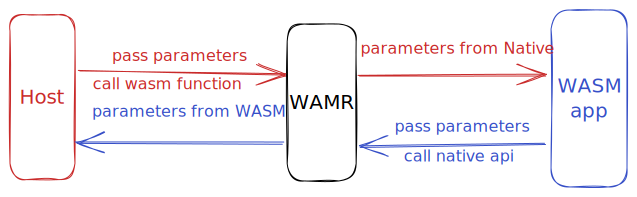
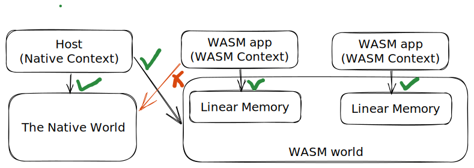
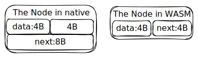
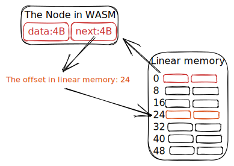

When discussing the method of transferring data between the Host and WASM app, we need to identify three concepts: **execution context, memory space and memory layout**.
This article will introduce these 3 concepts.

#### 1 Execution Context

The execution context refers to whether the currently executing code is WASM or Native. If WASM code is currently running, we call it the WASM context. If Native code is currently running, we call it the Native context.

According to this concept, we can distinguish two situations:
**WASM to Host** and **Host to WASM**.

* **WASM to Host** : The data transmission direction is from WASM app to Host, which usually occur in `wasm call native`.

* **Host to WASM** : The data transmission direction is from Host to WASM app, which usually occur in `native call wasm`.



#### 2 Memory space

Memory space refers to the memory area that a program can legally access during execution. We call the linear memory specifically accessed by WASM the WASM world, and the memory space requested by a native program for the Native context the naive world.

Obviously, in the Native context, you can access both worlds, but in the WASM context, you can only access the WASM world. Note that a WASM module instance can only access its own linear memory, and cannot access the linear memory of other WASM module instances.



We can distinguish two situations based on this concept: **data stored in the WASM world** and **data stored in the Native world**.

#### 3 Memory Layout

Memory layout refers to the rules for arranging data in memory space, especially the structural memory alignment rules and the specific meaning of pointers.
##### 3.1 Alignment rules for structure
The alignment rules for structure in Native world may be different from those in WASM world. In addition, the pointer of WASM is an offset in Native content, which requires calling 'wasm_runtime_addr_app_to_native` to get the real pointer.

```cpp
struct Node {
    int data;
    struct Node *next;
};
```

Taking the `Node` structure above as an example, if the pointer in native world is 64 bits but the pointer in WASM world is 32 bits, errors will occur when directly using data from one world in another world.


```c
// In native context
void access_pointer(wasm_exec_env_t exec_env, struct Node *wasm_data) {
    wasm_module_inst_t wasm_module_inst = NULL;
    // Error may occur here, because offsetof(struct Node, next) == 8
    // but the 'next' pointer is stored in offset 4
    wasm_data->next;
}
```
##### 3.2 The meaning of pointer 
Taking the `Node` structure above as an example, with consistent structure layout, when the Native context accesses the `Node` structure in the WASM world, it is not possible to directly access the `next` pointer, because the pointer in the WASM world is an offset like an index of an array.
So it is necessary to convert the `next` pointer in WASM to a real pointer.



```c
// In native context
void access_pointer(wasm_exec_env_t exec_env, struct Node *wasm_data) {
    wasm_module_inst_t wasm_module_inst = NULL;
    struct Node *next = NULL;
    if(!exec_env || !(wasm_module_inst = wasm_runtime_get_module_inst(exec_env))) {
        assert(false);
    }
    // we need to convert this wasm offset to a native pointer
    next = (struct Node *)wasm_runtime_addr_app_to_native(wasm_module_inst, (uint32_t)wasm_data->next);
}
```

##### 3.3 Ensure the alignment rules of structures consistent in both worlds
To ensure the structure memory layout is consistent, we need to do some assertion while compiling the host program and wasm apps.
We use `static_assert` to achieve this goal.
```cpp
//An example of using structure pointer with same layout in native

//32bits alignment, pack(4)
struct Node {
    double value;
    int day;
};
//assertions for ensuring the consistency of the memory layout 
static_assert(
    sizeof(struct Node) == 12
    && offsetof(struct Node, value) == 0
    && offsetof(struct Node, day) == 8
);

//the native wrapper for wasm call native
//register signature: "(*i)"
void setDay(wasm_exec_env_t exec_env, struct Node *data, int day){
    data->day = day;
}
```