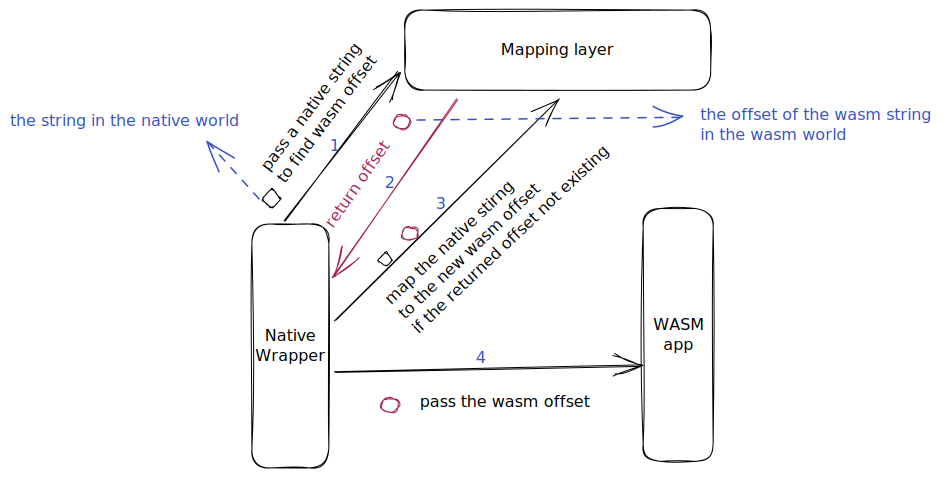
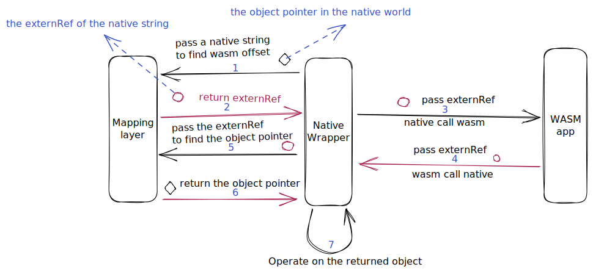

#### Overview: From Native to Wasm
This section mainly introduces the situation of transferring data from `the native world` to `the WASM world`, which usually occurs in two scenarios:
* Parameter transfer in `native call WASM`
* When `WASM call native`, the parameter is used to store the return value

It should be noted that `the WASM context` cannot directly access the memory of `the native world`, so in most cases, memory copying is still necessary.

Next, we will discuss the transmission of various parameters.

#### 1 Integer or floating-point

In this case, you do not need to perform any conversion, simply transfer the parameters and make the call.

#### 2 C-style string

In this case, since `the WASM context` cannot directly read the memory of `the native world`, we will process the string.

Here are three methods for your reference:
* copy the string
* map the string
* change the memory allocator used by native context

##### (1) copy the string

We can allocate a new block of memory in the target WASM module and completely copy the string. 

In this case, you need to decide who controls the newly applied memory, that is, who can modify it and who should release it.
```cpp
//An example of copying c-style from native to WASM
bool setStringWrapper(wasm_exec_env_t exec_env, char *data, int size) {
    wasm_module_inst_t wasm_module_inst = NULL;
    uint32_t offset_data = 0;
    char *pointer_data = NULL;

    uint32_t argv[4];
    wasm_function_inst_t wasm_func = NULL;
    
    if(!data || !size) {
        goto fail;
    }

    // Get the wasm module instance
    if(!(wasm_module_inst = wasm_runtime_get_module_inst(exec_env))){
        goto fail;
    }
    
    // Get the wasm funciton
    // The function signature in the WASM context is
    // bool setString(const char* data, int size)
    if(!(wasm_func = wasm_runtime_lookup_function(wasm_module_inst, "setString", NULL))){
        goto fail;
    }
    
    //allocate memory
    if(!(offset_data = wasm_runtime_module_malloc(wasm_module_inst, size, (void**)(&pointer_data)))){
        goto fail;
    }
    
    //copy string
    memcpy(pointer, data, size);
    
    // set parameters
    argv[0] = offset_data;
    argv[1] = size;
    
    //call wasm function
    if(!wasm_runtime_call_wasm(exec_env, wasm_func, 2, argv)){
        goto fail;
    }

    // The return value is stored in argv
    return (bool)argv[0];
fail:
    return false;
}
```

##### (2) create a mapping layer

If your string is unique, you may can first copy the string to `the WASM world`, then map native memory to WASM memory using some data structure (such as a hash table), and then pass this new memory to WASM. This approach is generally suitable for situations where strings are constants.



```cpp
// An example of mapping native c-style string to wasm c-style string

// This function will return the offset of the copy string in wasm_module_inst of native_data 
// return 0 if no copied string exists
uint32_t findMapping(wasm_module_inst_t wasm_module_inst, void *native_data);

// This function will map native_data to the offset of the copy string in wasm_module_inst
// return true if success
bool setMapping(wasm_module_inst_t wasm_module_inst, uint32_t offset, void *native_data);

bool setStringWrapper(wasm_exec_env_t exec_env, char *data, int size) {
    wasm_module_inst_t wasm_module_inst = NULL;
    uint32_t offset_data = 0;
    char *pointer_data = NULL;

    uint32_t argv[4];
    wasm_function_inst_t wasm_func = NULL;

    // ignore some code for getting wasm module instance and wasm function
    // ...
 
    // try to find mapping
    if(!(offset_data = findMapping(wasm_module_inst, (void*)data))){
        // ignore some code for copying string here
        // ...

        // set mapping
        setMapping(wasm_module_inst, offset_data, (void*)data);
    }
    // ignore some code for calling wasm function here
    // ...
}
```

##### (3) change allocator used by `the native context`

You can change the memory allocator when allocate memory in `the native context` to allocate memory in the linear memory of a specific WASM instance, so that both the native and WASM contexts can access that memory.
``` cpp
//An example of changing allocator

// target wasm module instance
static wasm_module_inst_t wasm_module_inst;

//the allocator used by the native context
void *hostMalloc(uint32_t size) {
    void *result = NULL;
    if(!wasm_runtime_module_malloc(wasm_module_inst, size, &result)){
        return NULL;
    }
    return result;
}

//call wasm function in the native layer
void callWasmFunction(wasm_exec_env_t exec_env, void *data){
    uint32_t argv[2];
    wasm_module_inst_t wasm_module_inst = NULL;
    // ignore some code for find wasm function here
    // ...

    //set the parameter
    argv[0] = wasm_runtime_addr_native_to_app(wasm_module_inst, data);
    
    // ignore some code for calling wasm function here
    // ...
}
```

#### 3 Structure pointer

When transferring structural data, we generally transfer structural pointers.
It should be mentioned again that `the WASM context` cannot directly access the memory of the native world, so in most cases, memory copying is still necessary.

**The following 3 methods involve memory copying.**

##### (1) Copy the entire structure

Similar to case **2-(1)**, you can copy the entire structure into `the wasm world`. Of course, you also need to decide who controls this memory, that is, who can modify it and who can release it.
Unlike copying C-style strings, we need to know the specific structure of the structure in `the native context` and may face multi-level copying.
For example, when copying the following structure, we not only need to copy the value of `size` (in level 1), but also need to allocate `size * sizeof(int)` bytes of memory for copying data of `data`(in level 2).

```cpp
struct Array {
    // the data of the array
    int *data;
    // the size of the array
    int size;
}
```

##### (2) serialization

You can also use serialization, such as **JSON**, **protobuf**, and so on.
Serialization is particularly suitable for message transmission across different WASM apps (running in `the WASM context`), where the Host (running in `the native context`) doesn't need to know the specific structure of the structure. Of course, you also need to decide who controls the serialized message.

##### (3) mapping layer

Similar to case **2-(2)**, you can create a mapping layer.

**If you want to avoid memory copying, you can consider the following 2 methods.**

##### (4) using handle from the native world

We can associate a handle with a native object, so that when WASM apps run, we can perform data operations by using the handle as a parameter of the native API for 'wasm call native'.
In this way, memory copying can be avoided, but the cost is that any operations related to the object must be completed by calling the native API.
The handle we said is like `externRef`, and in the following code we will use `externRef`.

```cpp
//An example of transfering data from native to WASM by using handle

//in native layer
struct nativeObject {
    uint32_t number;
    const char *name;
    uint32_t data[100000];
};

void nativeCallWasm(wasm_exec_env_t exec_env, nativeObject *obj){
    wasm_module_inst_t wasm_module_inst = NULL;
    uint32_t handle = 0;
    uint32_t argv[2];
    wasm_function_inst_t wasm_func = NULL;
    // Get the wasm module instance
    if(!(wasm_module_inst = wasm_runtime_get_module_inst(exec_env))){
        goto fail;
    }
    // Get the wasm funciton
    if(!(wasm_func = wasm_runtime_lookup_function(wasm_module_inst, "wasmFunction", NULL))){
        goto fail;
    }

    // set externRef
    if(!wasm_externref_obj2ref(wasm_module_inst, (void*)obj, &handle)){
        goto fail;
    }

    // set the parameter
    argv[0] = handle;

    // call wasm function
    if(!wasm_runtime_call_wasm(exec_env, wasm_func, 1, argv)){
        goto fail;
    }

    return;
fail:
    assert(false);
}

// the function for wasm call native
void setNumberWrapper(wasm_exec_env_t exec_env, uint32_t handle, uint32_t num){
    struct nativeObject *obj = NULL;
    if(!wasm_externref_ref2obj(handle, (void**)(&obj))){
        assert(false);
    }
    obj->number = num;
}

//in the wasm layer
typedef uint32_t nativeObject;
void wasmFunction(nativeObject data){
    setNumberWrapper(data, 20230410);
}
```

##### (5) changed allocator used by `the native context`

Similar to case **2-(3)**, you can change the memory allocator used by `the native context` to allow both worlds to access that memory, but it should be noted that `the memory layout` affects the way `the native context` accesses the structure. In `the native context`, it may be necessary to access memory through WAMR's API.
