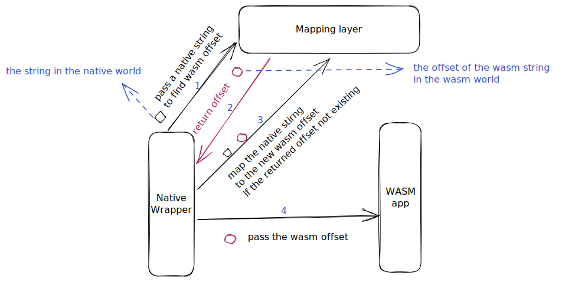
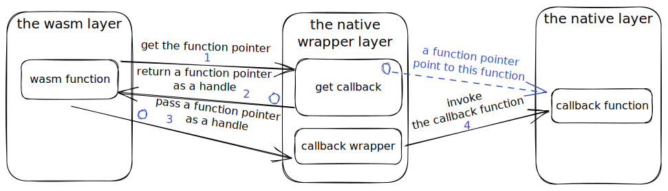
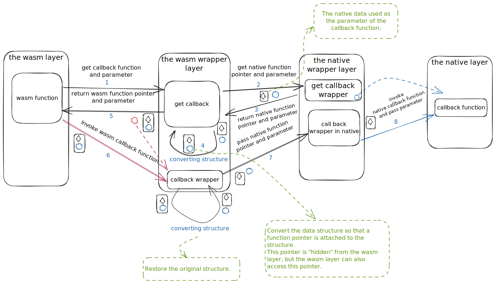
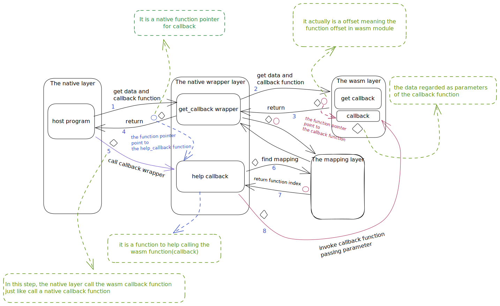

This article is a continuation of `Transferring data from wasm apps to host: Part 2`, mainly about the encapsulation of function pointer in different contexts.

#### 4 Structure is used to saved returned data

##### 4.1 The space of the returned data belongs to `the native world`
In `the wasm context`, we may save the returned data in the structure used as the parameter of `wasm call native`. If the space of the returned data is belongs to the native wolrd, then we have to do some additional work to make `the wasm context` accessible to this data.

###### 4.1.1 The native pointer is returned after `wasm call native`

The suggestions that can be given here are still the 2 methods provided above (see the blog `Transferring data from host to wasm apps`, please. You can refer to this blog for detailed methods).

* Establish a mapping from the native world memory to the wasm world memory

Here is an example of passing a `const char *` pointer. 



* Establish a mapping from the native world memory to the native handle

Here is an example of using `externRef` regarded as handle.


###### 4.1.2 The native function pointer is returned after `wasm call native`

If you need to use the native function pointer (callback) in `the wasm context`, we provide the following 2 methods according to the different use of the function pointer.

**(1) using native handle**

We can establish a mapping from a native function pointer to a native handle and pass the native handle to `the WASM context`.



In the WASM context, we invoke the callback function by taking the native handle and the parameters of the callback function as parameters of `wasm call native`.

The function pointer itself is unique, so it can be directly used as a handle.

```cpp
// An example of using externalRef to callback
// execute test_call_back_in_wasm
struct Node {
    int value;
    void (*func)(int);
};

// the native layer
void call_back(int value){
    printf("call back! %d\n", value);
}
// the native wrapper layer

void get_call_back(wasm_exec_env_t exec_env, struct Node *stored){
    stored->value = 10;
    stored->func = call_back;
}

// the function for wasm call native
void call_back_wrapper(wasm_exec_env_t exec_env, const struct Node *stored){
    stored->func(stored->value);
}

// the wasm layer
void test_call_back_in_wasm() {
    struct Node tmp;
    // call native api
    get_call_back(&tmp);
    // call native api
    call_back_wrapper(&tmp);
}

```

**(2) using native function pointers just like calling function**

The key point of this method is to establish a `one-to-one mapping` between a object and the callback function pointer. This object can be `the parameter of the callback function`, `the caller of the callback function`, `a unique value` (such as native handle), etc.

The following example reconstructs the parameters of the callback function to achieve one-to-one mapping. Of course, you can also achieve this mapping through a hash table.



```cpp
// execute test_call_back_in_wasm

// the structure in the native world
struct Node {
    int value;
};
typedef void (*func_type)(struct Node*);

// the native layer
void call_back(struct Node* data){
    printf("call back! %d\n", data->value);
}

// the native wrapper layer

//register as "(**)"
void get_call_back_wrapper(wasm_exec_env_t exec_env, struct Node *stored, func_type *func){
    stored->value = 10;
    *func = call_back;
}

// register as "(i*)"
void call_back_wrapper_in_native(wasm_exec_env_t exec_env, func_type func, const struct Node *data){
    func(data);
}

/*================================================*/

// the structure in the wasm world
struct Node {
    int value;
    uint32_t func;
};
typedef void (*func_type)(struct Node*);

// the wasm wrapper layer
void call_back_wrappr(struct Node *tmp) {
    call_back_wrapper_in_native(tmp->func, tmp);
}

void get_call_back(struct Node *tmp, func_type *func){
    // call native api
    get_call_back_wrapper(tmp, func);
    tmp->func = (uint32_t)(*func);
    *func = call_back_wrapper;
}

// the wasm layer
void test_call_back_in_wasm(function_pointer handle) {
    struct Node tmp;
    func_type func;
    // call wasm wrapper
    get_call_back(&tmp, &func);
    // call back
    // using native function pointers just like calling function
    func(&tmp);
}
```
##### 4.2 The space of the returned data belongs to `the wasm world`
This situation should be classified as `wasm to host`, you can refer to the article: `Transferring data from host to wasm apps`

#### 5 Passing function pointer to the native context
The previous section introduced an example of calling back the native function pointer in the wasm context.

This section describes how to call back wasm function pointer in the native context.

Here are 2 methods available.

##### 5.1 Direclty using WAMR's api `wasm_runtime_call_indirect`

##### 5.2 Using a mapping layer to create a one-to-one maping between a object and a callback funtion pointer.

The following example establishes a mapping from parameters to callback functions.

```cpp
// Parameter type of callback function
struct calll_back_parameter;
// Types of callback functions
typedef void (*func_type)(struct calll_back_parameter *);

struct Node {
    // parameter
    struct calll_back_parameter *now;
    // function pointer
    func_type func;
};

struct mapping_value {
    wasm_exec_env_t exec_env;
    uint32_t call_back;
}

// The maping layer

// set mapping
void set_mapping(void* address, struct mapping_value *obj);
// get mapping
struct mapping_value* get_mapping(void * address);

// The native wrapper layer
void help_call_back(struct calll_back_parameter *now) {
    // get mapping value
    struct mapping_value *value = get_mapping((void*) now);
    wasm_module_inst_t wasm_module_inst = wasm_runtime_get_module_isnt(value->exec_env);
    uint32_t argv[2];
    
    // get offset
    now = (struct calll_back_parameter *) wasm_runtime_addr_native_to_app(wasm_module_inst, (void*) now);
    argv[0] = (uint32_t) now;
    // call back
    wasm_runtime_call_indirect(exec_env, value->call_back, 1, argv);
}

void get_callback_wrapper(wasm_exec_env_t exec_env, struct Node *stored){
    wasm_module_inst_t wasm_module_inst;
    wasm_funtion_inst_t func;
    struct calll_back_parameter *parameter;
    struct mapping_value value;
    struct Node *tmp;

    uint32_t argv[2];
    //ignore some code here ...

    // The wasm function called is
    // struct Node * getCallBack();
    wasm_runtime_call_wasm(exec_env, func, 0, argv);
    
    // get native pointer
    tmp = (struct Node*) wasm_runtime_addr_app_to_native(wasm_module_inst, argv[0]);

    // get parameter
    parameter = (struct calll_back_parameter*) wasm_runtime_addr_app_to_native(wasm_module_inst, (uint32_t)tmp->now);

    value.exec_env = exec_env;
    value.call_back = tmp->func;
    // set mapping
    set_mapping((void*) parameter, value);
    
    // return the result
    // Replace tmp->func with help_call_back
    stored->now = parameter;
    stored->call_back = help_call_back;
    return;
}

// The native layer
int main(){
    uint32_t argv[4];
    wasm_exec_env_t exec_env;
    struct Node tmp;
    //ignore some code ...
    
    // Call the native wrapper function
    // to get the parameter and callback function
    get_callback_wrapper(exec_env, &tmp)

    //call back
    tmp.func(tmp.now);
}

```