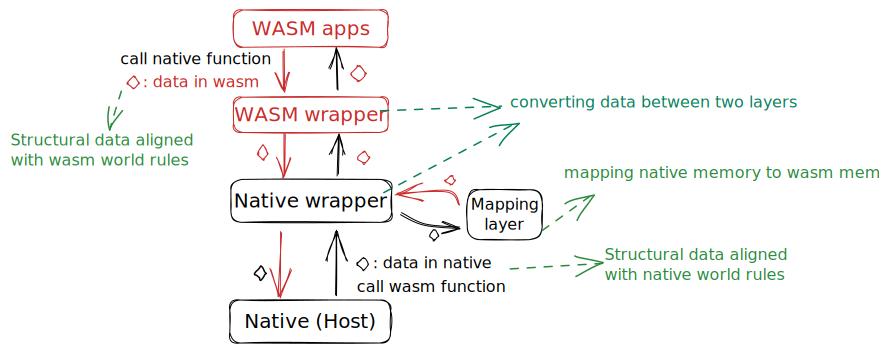
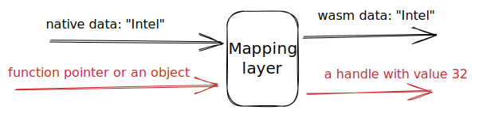
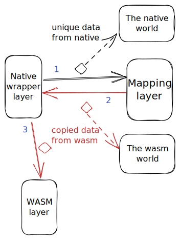

### Architecture for transferring data between Host and WASM app

To facilitate handling various situations of data transmission, we need to design an overall architecture to handle data transmission situations. Of course, you don't necessarily need this architecture, it's just a reference.

This architecture is divided into 5 layers: `the native layer`, `the native wrapper layer`, `the wasm wrapper layer`, and `the wasm layer`, `the mapping layer`.



`The native layer`, `the native wrapper layer` and `the mapping layer` are all running in `the native context`, `while the wasm layer` and `the wasm wrapper layer` are both running in `the wasm context`.

#### 1. native layer and the native wrapper layer

`The native layer` is composed of native functions, and implement the function of the native API.

In `the native wrapper layer` is composed of native functions too, But implement the function of data conversion between two worlds. We can process parameters and try to solve data transmission problems in this layer.

It is worth noting that during `native call wasm`, it is not necessary to pass through `the native wrapper layer`.

Here is an `wasm cal native` example to show `the native wrapper layer` and `the native layer`.

```cpp
//structure
enum OP {
    SUM,
    COUNT_ZERO
};
struct Data{
    int size;
    enum OP op_type;
    int *data;
};
//the native wrapper later
int native_function_wrapper(wasm_exec_env_t exec_env, struct Data *wasm_data) {
    wasm_module_inst_t wasm_module_inst = NULL;
    struct Data tmp = *wasm_data;
    int ans = 0;
    if(!exec_env || !(wasm_module_inst = wasm_runtime_get_module_inst(exec_env))) {
        assert(false);
    }
    // we need to convert this wasm offset to a native pointer
    tmp.data = (int *)wasm_runtime_addr_app_to_native(wasm_module_inst, (uint32_t)wasm_data->data);
    switch(wasm_data->op_type){
        case SUM:
        ans = sum(&tmp);
        break;
        case COUNT_ZERO:
        ans = count_zero(&tmp);
        break;
        default:
        assert(false);
    }
    return ans;
}
//the native layer
int sum(struct Data *data) {
    int size = data->size;
    int ans = 0;
    while(size--) {
        ans += data->data[size];
    }
    return ans;
}

int count_zero(struct Data *data) {
    int size = data->size;
    int ans = 0;
    while(size--) {
        ans += (0 == data->data[size]);
    }
    return ans;
}
```

#### 2. wasm layer and the wasm wrapper layer

`The WASM layer` is composed of wasm functions, and implement the main function of wasm app.

In `the wasm wrapper layer` is composed of wasm functions too, But implement the function of data conversion between two worlds. We can process parameters and try to solve data transmission problems in this layer.

It is worth noting that during `wasm call native` or `native call wasm`, it is not necessary to pass through `the wasm wrapper layer`

Here is an `wasm call native` example to show `the wasm wrapper layer` and `the wasm layer`.

```cpp
//the wasm wrapper later
int sum(int data[], int size){
    struct Data tmp = {
        size,
        SUM,
        &data
    };
    // call naive api
    return native_function_wrapper(&tmp);
}
//the wasm layer
int main(){
    int data[] = {1, 2, 3};
    printf("%d\n",sum(data, sizeof(data)/sizeof(data[0])));
    return 0;
}
```
#### 3. mapping layer


`The mapping layer` is running in `the native context`.

Sometimes there may be unique data in the native world, and wasm apps cannot directly access this data due to sandbox isolation. At this point, we may need `a mapping layer` that can solve some of the problems. This mapping layer is useful for mapping some constant data.
This layer will map some unique data in `native world` to a copy in `wasm world` or a handle, such as mapping a string "Intel" in `the native world` to a copied string "Intel" in `the wasm world`, or a handle with a value of 32 (in this case, in `the wasm context`, this handle represents the string "Intel"). 



It is worth noting that during `wasm call native` or `native call wasm`, it is not necessary to pass through `the mapping layer`