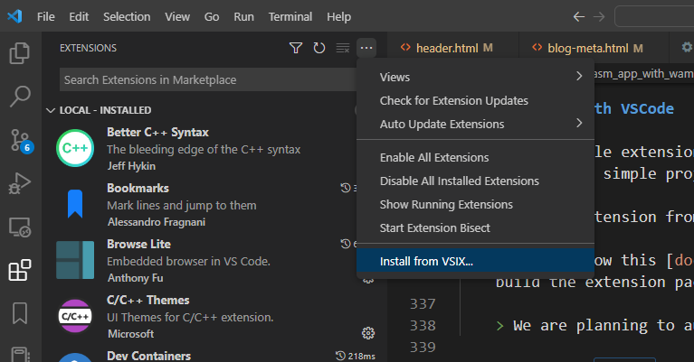
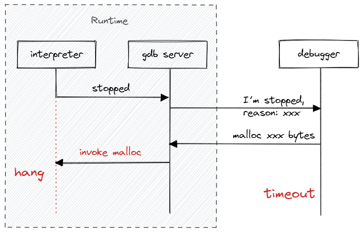

<center><small>Image from https://pspdfkit.com/blog/2020/the-state-of-debugging-in-webassembly/</small></center>



## Background

Debugging takes a great part in application development, debuggers provide the capability to inspect the internal state of the execution programs, which make it easier to let the program work properly. It is hard to imagine a programming world without debugger.

Luckily, WAMR has supported source debugging feature based on lldb, and now is ready for use.

> Thanks [@Paolo Severini](https://reviews.llvm.org/p/paolosev/) from Microsoft for providing the patched lldb with WebAssembly support!
>
> Thanks [@Wu Zhongmin](mailto://zhongmin.wzm@antgroup.com) from Ant group for co-working on the source debugging feature!
>
> 🎉🎉🎉

## Setup

1. Building WAMR with interpreter debugging enabled

    ``` bash
    git clone https://github.com/bytecodealliance/wasm-micro-runtime.git
    cd wasm-micro-runtime
    export WAMR_REPO=`pwd`
    cd product-mini/platforms/linux
    mkdir build && cd build
    cmake .. -DWAMR_BUILD_DEBUG_INTERP=1 -DWAMR_DISABLE_HW_BOUND_CHECK=1
    make
    export IWASM=`pwd`/iwasm
    ```

    > We need to disable the `hardware boundary check` feature, otherwise the debugger will not be able to stop when an `out of bounds memory access` exception occurs.

    > We will use `$IWASM` to represent the generated iwasm binary in this step, and `$WAMR_REPO` represent the path to WAMR repo.

2. Building lldb from source code

    Official lldb and gdb doesn't support WebAssembly yet, we need to build the patched lldb manually from source code.

    ``` bash
    git clone --branch release/13.x --depth=1 https://github.com/llvm/llvm-project.git
    cd llvm-project
    git apply $WAMR_REPO/build-scripts/lldb-wasm.patch
    mkdir build && cd build
    cmake -DCMAKE_BUILD_TYPE:STRING="Release" -DLLVM_ENABLE_PROJECTS="clang;lldb" -DLLVM_TARGETS_TO_BUILD:STRING="X86;WebAssembly" -DLLVM_ENABLE_LIBXML2:BOOL=ON ../llvm
    make -j $(nproc)
    export LLDB_BUILD_DIR=`pwd`
    ```

    > We will use `$LLDB_BUILD_DIR` to represent the current build dir

    > Binary release for this patched lldb is planned and WIP, once finished, we can download the binaries directly😀.

## Debugging with CLI

Let's take a simple application written in C for example.

``` c
// main.c

#include "stdio.h"

double global_variable = 0;

void foo2()
{
    printf("The global var is: %f\n", global_variable);
}

int foo(int x)
{
    printf("The parameter is: %d\n", x);
    foo2();
    return x;
}

int main(int argc, char *argv[])
{
    int local_variable = 0;
    int i = 0;

    foo(local_variable);

    for (i = 0; i < local_variable; i++) {
        printf("Enter loop with i = %d\n", i);
    }

    return 0;
}
```

This simple code involves `local variable`, `global variable`, `function call` and `loop`, which can used to demonstrate most abilities of the debugger.

1. Build this sample code with `wasi-sdk`

``` bash
/opt/wasi-sdk/bin/clang -g main.c -o main.wasm -Wl,--export=malloc,--export=free
```

> Don't enable optimizations, and don't miss the `-g` option, otherwise the generated wasm file will not contain debug information.

> `-Wl,--export=malloc,--export=free` is required if you want to use the `evaluation expression` feature, please refer to [issue with evaluation feature](#issue-with-evaluation-feature) for more details.

2. launch the wasm app with debug feature enabled

``` bash
$IWASM -g=127.0.0.1:1234 main.wasm
#         ^^^^^^^^^ ^^^^
#         bind addr:port
```

3. open another terminal to launch lldb and attach to the debug server

> Note: In the new terminal, the environment variable `LLDB_BUILD_DIR` may not exists, you may need to set it again manually.

``` bash
# set LLDB_BUILD_DIR <path to your lldb build dir>
$LLDB_BUILD_DIR/bin/lldb
(lldb) process connect -p wasm connect://127.0.0.1:1234
Process 1 stopped
* thread #1, name = 'nobody', stop reason = signal SIGSTOP
    frame #0: 0x40000000000001c6 main.wasm
->  0x40000000000001c6: call   7
    0x40000000000001cc: call   12
    0x40000000000001d2: local.set 0
(lldb)
```

Everything ready!🍻 Now we can start debugging the application.

- **Breakpoint/Continue**

    Now let's create a breakpoint on a function and continue execution.

    ``` bash
    (lldb) b foo
    Breakpoint 1: where = main.wasm`foo + 37 at main.c:14:38, address = 0x4000000000000273
    (lldb) c
    Process 1 resuming
    Process 1 stopped
    * thread #1, name = 'nobody', stop reason = breakpoint 1.1
        frame #0: 0x4000000000000273 main.wasm`foo(x=0) at main.c:14:38
           11
           12   int foo(int x)
           13   {
        -> 14       printf("The parameter is: %d\n", x);
           15       foo2();
           16       return x;
           17   }
    ```

- **Backtrace**

    ``` bash
    (lldb) bt
    * thread #1, name = 'nobody', stop reason = breakpoint 1.1
      * frame #0: 0x4000000000000273 main.wasm`foo(x=0) at main.c:14:38
        frame #1: 0x400000000000030e main.wasm`__main_argc_argv(argc=1, argv=0x00011500) at main.c:24:5
        frame #2: 0x4000000000002772 main.wasm
        frame #3: 0x40000000000003a8 main.wasm
        frame #4: 0x40000000000001d2 main.wasm
    ```

    You can use `up`/`down` to navigate across the stack frames

- **Display variables**

    ``` bash
    (lldb) up
    (lldb) fr v # dump variables from current stack frame
    (int) argc = 1
    (char **) argv = 0x00011500
    (int) local_variable = 0
    (int) i = 0
    (lldb) fr v global_variable # dump global_variable
    (double) global_variable = 0
    ```

- **Evaluate expressions**

    ``` bash
    (lldb) e local_variable
    (int) $0 = 0
    (lldb) p local_variable
    (int) $1 = 0
    (lldb) e local_variable > 0
    (bool) $2 = false
    ```

    > Note:
    > 1. If you encounter an error while using evaluation feature, please refer to [issue with evaluation feature](#issue-with-evaluation-feature)
    > 2. in lldb `p` command actually use `evaluation`.

- **Step/Finish**

    ``` bash
    (lldb) s
    Process 1 stopped
    * thread #1, name = 'nobody', stop reason = step in
        frame #0: 0x400000000000283c main.wasm
    ->  0x400000000000283c: global.get 0
        0x4000000000002842: i32.const 16
        0x4000000000002844: i32.sub
        0x4000000000002845: local.tee 2
    (lldb) n
    Process 1 stopped
    * thread #1, name = 'nobody', stop reason = instruction step over
        frame #0: 0x4000000000002842 main.wasm
    ->  0x4000000000002842: i32.const 16
        0x4000000000002844: i32.sub
        0x4000000000002845: local.tee 2
        0x4000000000002847: global.set 0
    (lldb) finish
    Process 1 stopped
    * thread #1, name = 'nobody', stop reason = step out
        frame #0: 0x4000000000000293 main.wasm`foo(x=0) at main.c:14:5
       11
       12   int foo(int x)
       13   {
    -> 14       printf("The parameter is: %d\n", x);
       15       foo2();
       16       return x;
       17   }
    (lldb) finish
    Process 1 stopped
    * thread #1, name = 'nobody', stop reason = step out
        frame #0: 0x400000000000030e main.wasm`__main_argc_argv(argc=1, argv=0x00011500) at main.c:24:5
       21       int local_variable = 0;
       22       int i = 0;
       23
    -> 24       foo(local_variable);
       25
       26       for (i = 0; i < local_variable; i++) {
       27           printf("Enter loop with i = %d\n", i);
    ```

- **Modify the value**

    ``` bash
    (lldb) e local_variable = 5
    (int) $3 = 5
    (lldb) c
    Process 1 resuming
    Process 1 exited with status = 0 (0x00000000)
    ```

    Since we modify the value of `local_variable` to 5, we will enter the loop 5 times, and then the program exit.

- **Exception**

    When debugging a native executable, the debugger will stopped once there is a segment fault, and the developer can then see the callstack to the bug code.

    However, in WebAssembly the memory is protected by sandbox, even the application access some invalid spaces, the runtime will raise an exception rather than segment fault.

    In WAMR, we extend the debug engine to pause on exception, so the developer can inspect the latest state of the program and know which line in source code causes this problem.

    ``` C
    int main(int argc, char *argv[])
    {
        int local_variable = 0;
        int i = 0;

        *(int *)(-1) = local_variable;

        foo();

        for (i = 0; i < local_variable; i++) {
            printf("Enter loop with i = %d\n", i);
        }

        return 0;
    }
    ```

    This time we add a line to the original `main.c`. `(int *)(-1)` is a very large space and certainly go beyond the linear memory boundary, this will trigger an `out of bound memory access` exception.

    ``` bash
    /opt/wasi-sdk/bin/clang -g main.c -o main.wasm
    $IWASM main.wasm
    Exception: out of bounds memory access
    ```

    Launch it with debug feature, and continue execution

    ``` bash
    $IWASM -g=127.0.0.1:1234 main.wasm
    ```

    ``` bash
    $LLDB_BUILD_DIR
    (lldb) process connect -p wasm connect://127.0.0.1:1234
    Process 1 stopped
    * thread #1, name = 'nobody', stop reason = signal SIGSTOP
        frame #0: 0x40000000000001c6 main.wasm
    ->  0x40000000000001c6: call   7
        0x40000000000001cc: call   12
        0x40000000000001d2: local.set 0
    (lldb) c
    Process 1 resuming
    Process 1 stopped
    * thread #1, name = 'nobody', stop reason = Exception: out of bounds memory access
        frame #0: 0x4000000000000290 main.wasm`foo(x=0) at main.c:14:18
       11
       12   int foo(int x)
       13   {
    -> 14       *(int *)(-1) = 100;
       15       printf("The parameter is: %d\n", x);
       16       foo2();
       17       return x;
    ```

    Then we can see the call stack and inspect stack frames. If the exception occurs in a large project, this feature will save a lot of time to find the root cause.

Now we have tried some common used features of debugger, but it's finished by command line. **Is there a more efficient way?**

**Of course!**

## Debugging with VSCode

VSCode's flexible extension system make it very easy to integrate any debuggers to its UI, we have developed a VSCode extension to provide some simple project management functionality, and of cause, including the debugging feature.

1. Build the extension from source

    Please follow this [document](https://github.com/bytecodealliance/wasm-micro-runtime/tree/main/test-tools/wamr-ide) to build the extension package.

    > We are planning to automatically publish this extension by GitHub action, once finished, this step is not necessary.

2. Install the `.vsix` file from VSCode

    

Now, enjoy the VSCode's debugging session! This video demonstrates the basic usage of the extension.



<video width="100%" height="auto" controls>
    <source src="debug_demo.mp4" type="video/mp4">
    Your browser does not support the video tag.
</video>


## Remote debugging

When debugging feature enabled, WAMR will host a gdb server and wait for a debugger connection, it is already a remote debugging architecture.

If you want to run `runtime` and `debugger` in different machine, then you should take care about these 3 things:

1. Bind address `0.0.0.0` rather than `127.0.0.1`
2. There should be a copy of source code on the debugger machine, and a source-map is correctly set after launching LLDB, otherwise the debugger will not be able to find the source lines

   ``` bash
   (lldb) settings set -- target.source-map <src_dir> <dest_dir>
   ```

3. WAMR uses Unix signal numbers, if your debugger runs on non-Linux platforms (e.g. Windows), remember to set the remote platform before connecting

    ``` bash
    (lldb) platform select remote-linux
    (lldb) process connect -p wasm connect://xxx.xxx.xxx.xxx:1234
    ```

## Issue with evaluation feature

lldb will require a large buffer inside linear memory when evaluating an expression, we call it `Evaluation buffer` here.

The problem happens when the application is built with `wasi` mode and exported the `malloc` function:
- the interpreter stops at somewhere because of breakpoint or stepping, lldb become interactive
- user enter a command to evaluate an expression
- lldb send a allocate memory request to runtime (debug server)
- runtime will invoke the `malloc` function in wasm application (which means we need to re-enter the interpreter), but at this moment the interpreter is at stop state and waiting debugger's signal to continue execution, which cause the program to hang.



To solve this problem, we try to reserve enough memory space in linear memory during loading, and if the runtime failed to allocate this buffer during loading, a warning will be displayed:

``` bash
[09:43:45:506 - 7FA23A5EFB80]: warning: allocate 544768 bytes memory failed
[09:43:45:540 - 7FA23A5EFB80]: WASM Debug Engine warning: failed to allocate linear memory for execution.
Will not be able to evaluate expressions during debugging
[09:43:45:733 - 7FA23A96F700]: control thread of debug object 0x55fb399d3d20 start

[09:43:45:841 - 7FA23A96F700]: Debug server listening on 127.0.0.1:1234
```

and any evaluation command in debugger session will not work and get such kind of error:

``` bash
error: Couldn't allocate space for materialized struct: Couldn't malloc: address space is full
error: errored out in DoExecute, couldn't PrepareToExecuteJITExpression
```

#### How to fix the warning?

If you don't need the evaluation feature, then just ignore the warning and it will not influence other features, otherwise the solution depends on the libc mode

- If your app is built with `libc-wasi`

    1. If your wasm module doesn't export `malloc` and `free`, try to rebuild your wasm module with `-Wl,--export=malloc,--export=free` option, or refer to the method for `libc-builtin` mode

    2. Otherwise, seems you set the `maximum memory` flag during compiling and the given value is not enough, try to rebuild with a larger value or remain maximum memory unspecified.

- If your app is built with `libc-builtin`

    In this mode, all the dynamic memory goes into WAMR's `app_heap`, the design of WAMR's linear memory will not be covered by this blog post, please refer to our [memory_tune](https://github.com/bytecodealliance/wasm-micro-runtime/blob/main/doc/memory_tune.md) document for more details.

    The problem is `app_heap` is not enough, specify a larger value can solve this

    ``` bash
    $IWASM -g=127.0.0.1:1234 --heap-size=655360 main.wasm
    ```

> This size should be no less than `532 KB` (`544768 bytes`)

## FAQ

- **Does WAMR's source debugging support `watchpoint`?**

    Currently not, but this feature is planned and on the priority list.

- **Which platforms are supported**

    Currently the source debugging feature supports Linux, Windows, MacOS, Android, other platforms may work but not well tested.

- **Does this support debugging `AssemblyScript`?**

    Unfortunately, No. We use `dwarf` based debugging solution while AssemblyScript currently uses source map.

- **Does this feature support embedded devices?**

    Source debugger feature mainly depends on socket interface.

    If your platform support socket then it should be OK.

    But for devices only have `USART` interface, currently we don't support that. This requires a usart based communication channel, it should not be very complex to implement, but it's not on our priority list.

- **Does this work with AOT/JIT**

    Debugging AoT/JIT module is totally a different solution which is not covered by this blog.

    Currently WAMR has a highly experimental support for AOT/JIT debug, please refer to the [document](https://github.com/bytecodealliance/wasm-micro-runtime/blob/main/doc/source_debugging.md#debugging-with-aot) for more details.

- **Does this work with `multi-thread wasm application`?**

    No, currently the debugger can't distinguish stack frame from different thread, if you attempt to debug a multi-thread wasm app, there may be unexpected behavior.

- **Does this work with `multiple native thread and each thread runs a wasm app`?**

    Yes, each app will have its own gdb server, they are totally independent.
