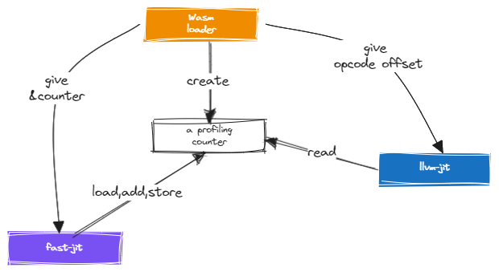
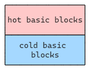

# Introducing the Dynamic Profiling Guided Optimization Framework

We are excited to announce a major enhancement to our JIT compiler - the Dynamic Profiling Guided Optimization (DPGO) framework. DPGO is a JIT compiler optimization technique that allows the JIT to collect additional information about the execution environment in tier-1 code generation. This information is then used during promotion from tier-1 to tier-2 for hot methods to make them even more efficient.

## Overview

The DPGO framework consists of:

- **Tier-1 JIT** - The fast JIT in WAMR that performs initial compilation and collects profiling data like method invocation counts.

- **Tier-2 JIT** - The LLVM JIT in WAMR that optimizes hot methods using advanced techniques.

- **Controller** - A native thread that identifies hot methods and triggers optimization. The controller uses the `--hot-func-threshold` option to determine hot methods based on invocation counts.

The DPGO framework involves two separate JIT tiers - the fast JIT for initial compilation and profiling, and the optimizing LLVM JIT. A key challenge is correlating profiling data between these tiers, since they use completely disconnected intermediate representations (IRs) and control flow graphs (CFGs). The LLVM JIT cannot map its own IRs and basic blocks (BBs) back to the fast JIT's IRs and BBs where counters were generated.

To bridge this gap, the framework takes an _opcode-centric_ approach. Optimizers in the LLVM JIT specify their profiling data requirements. Based on this, the Wasm loader allocates counters for relevant opcodes - like conditional branches for branch weights. Later, the fast JIT inserts counter operations when emitting IR for these opcodes (communication happens offline between developers).

Despite disconnected IRs, the LLVM JIT can retrieve profiling counters during opcode traversal to incorporate into its optimizations. It generates IR based on opcodes, and knows where profiling data is needed. When it processes an opcode with an associated counter, it looks up the counter and adds profiling metadata to guide compilation.

So while the JITs have separate IRs, profiling data can still be leveraged across tiers by tying counters to opcodes. The Wasm loader and fast JIT establish this mapping between opcodes and counters. The LLVM JIT is then able to consume profiling data by retrieving counters based on opcodes.

## Trigger Conditions

In addition to `--hot-func-threshold`, we can technically set other conditions to let the _controller_ trigger optimization.

## Optimizations Enabled by PGO

DPGO allows accurately identifying hot code paths based on real profiling data. Therefore, it is able to "reshape" generated binaries without causing issues.

> **Warning:**
> PGO is very sensitive to input data. Variant input data will form variant "execution paths", accumulate variant profiling data, and lead to variant optimized results. An inappropriately optimized binary will not just underperform on new inputs but can also hurt performance.

### Branch Weights

Profiling guided branch weights is one possible optimization. It behaves like `likely` and `unlikely` hints but is added by the optimizer. Using profiling data, DPGO determines hot branch targets and re-lays out basic blocks. The algorithm ensures the shortest distance between conditional branch instructions and their hot targets. If there is no bias in the data, it does nothing. After optimization, all hot basic blocks will be placed before any cold basic blocks.

The hot region of the optimized function will be easy to cache. So there will be more near jumps during execution compared to the unoptimized version. The "cache missing" rate should improve.

### Guided Inlining

Inlining replaces a function call at the call site with the body of the callee function. This eliminates call overhead but increases binary size. With profiling data, more accurate hot caller-callee pairs can be identified. Replacement can be done in the hottest caller's body rather than in all callers' bodies. Therefore, the optimized result can have the lowest call overhead with a relatively small footprint.

### Method Splitting

This splits hot and cold methods into separate sections. It is another kind of "re-shaping" but at the method level instead of the basic block level. It requires the JIT to re-layout the jitted code buffer and store hot methods into a continuous memory area. It is also able to generate more near jumps during execution.

### Other Aggressive Optimizations

In addition to the optimizations listed above, many other possible aggressive optimizations can be implemented in the tier-2 JIT. We welcome any contributions in this direction.