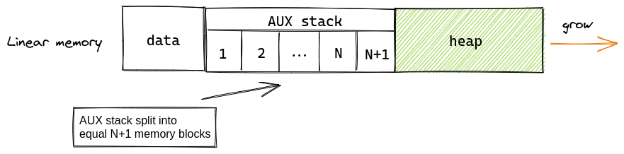
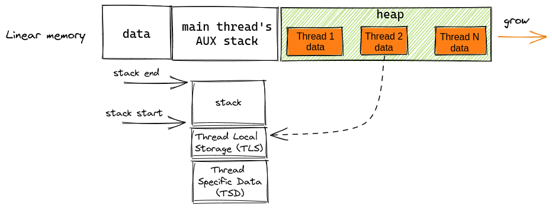

One of the functionalities missing in WebAssembly for a long time was the ability to spawn new threads within the process. Various runtimes made efforts to address this limitation by introducing non-standard APIs for thread creation. WAMR provides a [`WAMR pthread library`][wamr-pthread-library] that implements a wide range of pthread APIs, (including synchronization primitives, `pthread_create()` function and many more).

In 2022, the introduction of the [WASI threads proposal][wasi-threads-proposal] aimed to establish a standardized API for thread creation in WebAssembly. Subsequently, in 2023, both ([v1.2.0][wamr-1.2.0]) and [Wasmtime][wasmtime] implemented this proposal. This article delves into the implementation details of the WASI threads proposal within WAMR, shedding light on the distinctions between the newly introduced `WASI threads` and the pre-existing `WAMR pthread library` implementation.

See [the article][wasi-threads-announcement] on the Bytecode Alliance blog for the official WASI threads announcement.

## WASI threads - overview
WASI threads proposal (as of today) defines a single hostcall that needs to be implemented by the runtime:

```c
int32_t thread_spawn(uint32_t start_arg)
```
The purpose of this function is to start a new thread and return an identifier associated with that particular thread. The `start_arg` parameter denotes a value passed to the newly created thread (e.g. can be used as a pointer to a complex data structure in memory). The `thread_spawn` function is responsible for invoking the following entry function in the new thread:

```c
void wasi_thread_start(int32_t tid, uint32_t start_arg)
```

The `wasi_thread_start` function must be implemented and exported from the WASM module. The value of the `start_arg` parameter is the same as the one passed to the `thread_spawn` function.


## POSIX threads implementation
`WAMR pthread library` exposes POSIX Threads API to WASM code through native API functions.  Each supported function within the library is implemented in WAMR native code and essentially serves as a wrapper for POSIX Threads.

In contrast, the `WASI threads` proposal differs from `WAMR pthread library` implementation as it requires the host environment to only expose a single function (`thread_spawn`), while the complete implementation of the POSIX Threads API must be included in the WebAssembly code. Many of the API functions, such as `pthread_join` and TSD, have already been implemented in the [WASI libc][wasi-libc] and can be accessed through the WASI SDK starting from [version 20][wasi-sdk-20].


#### Synchronization primitives
The WASI threads proposal focuses only on spawning new threads and does not cover synchronization primitives. However, `WASI libc` already provides methods such as `pthread_mutex*` or `pthread_cond*` that are built on top of another proposal ([Threads and atomics](threads-and-atomics)). This proposal's implementation is available in WAMR from version [01-18-2022][wamr-01-18-2022].

## Memory model
The WASI threads proposal does not provide specific details about the memory model and treats it as an implementation detail. This paragraph highlights the differences between the memory models used in `WASI libc` and the `WAMR pthread` library.

The `WAMR pthread library` allocates stack memory for each thread from the auxiliary (AUX) stack. The AUX memory is divided into `N+1` equal regions, where `N` represents the maximum number of threads that WAMR can spawn. This maximum thread count can be controlled either through the `--max-threads=N` flag in `iwasm` or by setting it programmatically using the `wasm_cluster_set_max_thread_num()` API.



On the other hand, the `WASI libc` implementation dynamically allocates stack memory for each thread from the linear memory, utilizing `malloc()`. It also allocates memory for thread-local storage (TLS) and thread-specific data (TSD). However, it's important to note that TLS is not supported in the `WAMR pthread library`. The allocated memory is deallocated upon thread exit, making it available for reuse.


Dynamic memory allocation offers the advantage of more efficient memory usage compared to the `WAMR pthread library`'s approach. If an application doesn't frequently utilize the maximum number of threads specified by `--max-threads`, the pre-allocated memory for those threads remains unutilized, occupying unnecessary space. Additionally, dynamic allocation eliminates the need to determine the number of threads at build time since the AUX stack size is determined by the linker flag.

## WAMR implementation details
Underneath, the `WASI threads` feature leverages the existing [thread manager][wamr-thread-mgr] utilized by both the `WAMR pthread library` and the WAMR embedded scenario. The thread manager keeps track of all the threads within a process, allowing them to interact with each other. For example, if one thread encounters an error, the thread manager can share that information with all the other running threads.

Conceptually, the process of requesting a new thread in a high level can be summarized as follows:

1. Create a new instance of the module that requested a new thread
2. Create a new execution environment with the newly created module instance and add it to the thread manager's cluster
3. Spawn a native thread; in the thread's entry function, call an exported `wasi_thread_start` symbol from the module.
4. When the `wasi_thread_start` function completes (i.e. the thread is finished), destroy the module instance and execution environment

## Example
As an example, we'll compile and run a single hello world-like program on `iwasm` (the code comes from the [WASI threads announcement][wasi-threads-announcement] article):
```c
#include <pthread.h>
#include <stdio.h>
#include <string.h>

#define NUM_THREADS 10

void *thread_entry_point(void *ctx) {
  int id = (int) ctx;
  printf(" in thread %d\n", id);
  return 0;
}

int main(int argc, char **argv) {
  pthread_t threads[10];
  for (int i = 0; i < NUM_THREADS; i++) {
    int ret = pthread_create(&threads[i], NULL, &thread_entry_point, (void *) i);
    if (ret) {
      printf("failed to spawn thread: %s", strerror(ret));
    }
  }
  for (int i = 0; i < NUM_THREADS; i++) {
    pthread_join(threads[i], NULL);
  }
  return 0;
}
```

#### Configure WAMR
To enable WASI threads support in WAMR, the flag `WAMR_BUILD_LIB_WASI_THREADS` needs to be set to `1`. E.g. to build `iwasm` for linux platform, use:
```
cmake -Bbuild -Sproduct-mini/platforms/linux/ -DWAMR_BUILD_LIB_WASI_THREADS=1
```
In addition to that, user can specify a maximum number of running threads:
* for `iwasm`, use `--max-threads` CLI argument
* for embedded WAMR, use `wasm_runtime_set_max_thread_num` to set the max number of threads
If the max value is not specified, default value (currently set to 4) is used.

#### Compile WASM code
The easiest way to compile WASM application is through [WASI SDK v20][wasi-sdk-20] (threading support is available from version 20).

```
/opt/wasi-sdk/bin/clang --target=wasm32-wasi-threads -Wl,--max-memory=1048576 -pthread hello_world.c -o hello_world.wasm
```

#### Run WASM code

The program can be now run e.g. using `iwasm`:
```
./iwasm --max-threads=4 hello_world.wasm
```
And the output should be similar to:
```
Creating thread 0
Thread #262180, counter: 0
Creating thread 1
Thread #327860, counter: 0
Final counter value: 2
```

## Benchmarking
Just to demonstrate the potential benefits of running multi-threaded applications, we ran `iwasm` with two different parallelizable WASM programs:
* [sorting] - parallel implementation of merge sort
* [compression] - pigz and gzip compiled to WASM

| Number of threads | Compression | Sorting |
| ----------------- | ----------- | ------- |
|        1          | 67s | 11s |
|        2          | 39s | 6s |

As expected, WASM program with two threads is about two times faster than its single-threaded version.

## Next steps
In the past few months, the team spent a massive amount of time validating an implementation by testing various scenarios. That resulted with many bug fixes and significant stability improvements in the latest [WAMR 1.2.2][wamr-1.2.2] release. Thanks to a team effort, WAMR supports now multi-threading for interpreter (classic, fast), JIT (LLVM, fast) and AOT modes.  However, we're not done yet:
* Rust toolchain support - WASI threads are already available to C programs through WASI libc. Using threads in Rust was not straightforward, but there's already [work in progress][rust-wasi-pr] to implement the `std::thread` module from Rust standard library for the `wasm32-wasi-threads` target
* WASI threads API extensions - at the moment WASI threads API consists of a single function; there are currently discussions on whether more functions should be added to the interface (e.g. [the discussion][proc-exit-issue] about `pthread_exit`-like interface)
* many other bigger and smaller discussions regarding the specification - see [the Github page](https://github.com/WebAssembly/wasi-threads/issues) for all the open threads

## Contributors
The development of WASI threads in WAMR was a team effort involving various folks who deserve a big thanks:
* Alexandru Ene, Andrew Brown and Takashi Yamamoto for shaping the WASI threads proposal.
* Sam Clegg and Dan Gohman for their awesome work on the toolchain to support threading.
* Enrico Loparco, Georgii Rylov, Hritik Gupta and Wenyong Huang for making the proposal a reality in WAMR.


[wasi-threads-proposal]: https://github.com/WebAssembly/wasi-threads/
[wamr-pthread-library]: https://github.com/bytecodealliance/wasm-micro-runtime/blob/main/doc/pthread_library.md
[wamr-1.2.0]: https://github.com/bytecodealliance/wasm-micro-runtime/releases/tag/WAMR-1.2.0
[wamr-1.2.2]: https://github.com/bytecodealliance/wasm-micro-runtime/releases/tag/WAMR-1.2.2
[wamr-01-18-2022]: https://github.com/bytecodealliance/wasm-micro-runtime/releases/tag/WAMR-01-18-2022
[wamr-thread-mgr]: https://github.com/bytecodealliance/wasm-micro-runtime/tree/main/core/iwasm/libraries/thread-mgr
[wasi-libc]: https://github.com/WebAssembly/wasi-libc
[wasi-sdk-20]: https://github.com/WebAssembly/wasi-sdk/releases/tag/wasi-sdk-20
[threads-and-atomics]: https://github.com/WebAssembly/threads
[hello_world]: https://github.com/loganek/wasi-threads-examples/blob/main/hello_world/hello_world.c
[wasi-threads-announcement]: https://bytecodealliance.org/articles/wasi-threads
[sorting]: https://github.com/loganek/wasi-threads-examples/tree/main/merge_sort
[compression]: https://github.com/bytecodealliance/wasm-parallel-gzip
[rust-wasi-pr]: https://github.com/rust-lang/rust/pull/112922
[proc-exit-issue]: https://github.com/WebAssembly/wasi-threads/issues/7
[wasi-threads-issues]: https://github.com/WebAssembly/wasi-threads/issues
[wasmtime]: https://wasmtime.dev/

[img-memory-model-wamr]: https://excalidraw.com/#json=mjPc3NdhNJpFd99_we3T5,hD_WWhD2HId4W2qOUQVU2g
[img-memory-model-wasi-libc]: https://excalidraw.com/#json=Fua2Rzb1uRS6AsyIku72w,CIrYgPsmiqb68rlaVMLdMg