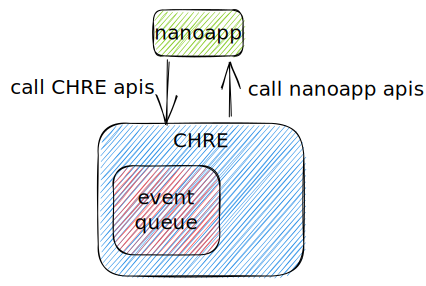
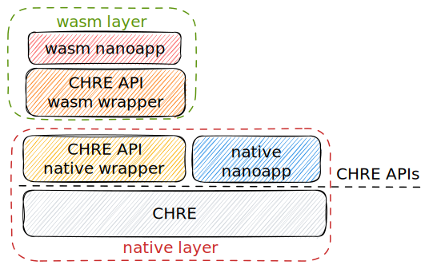
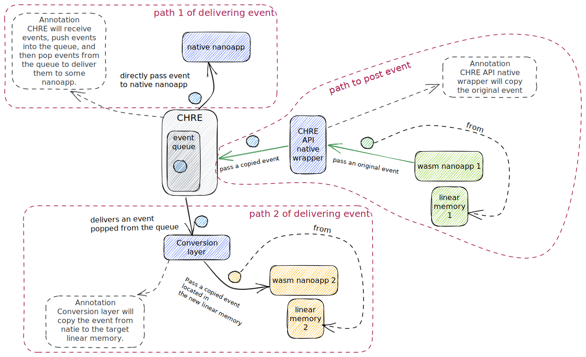
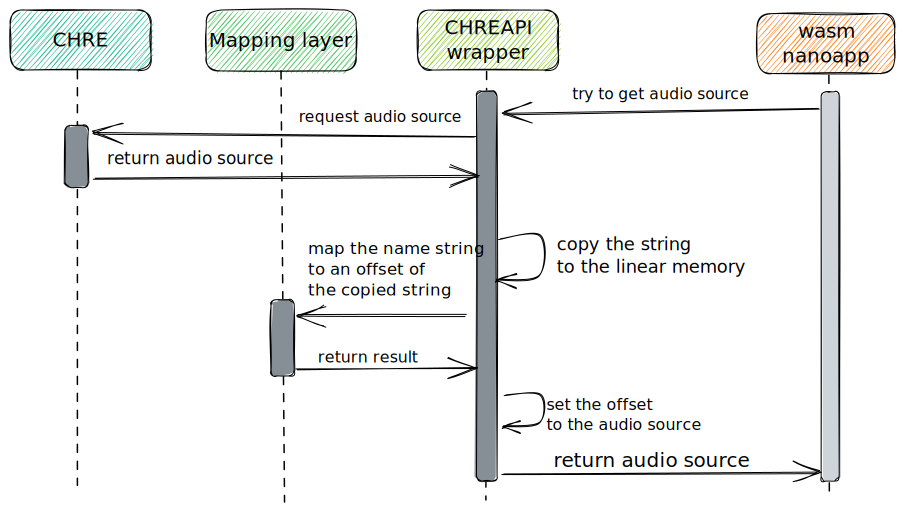
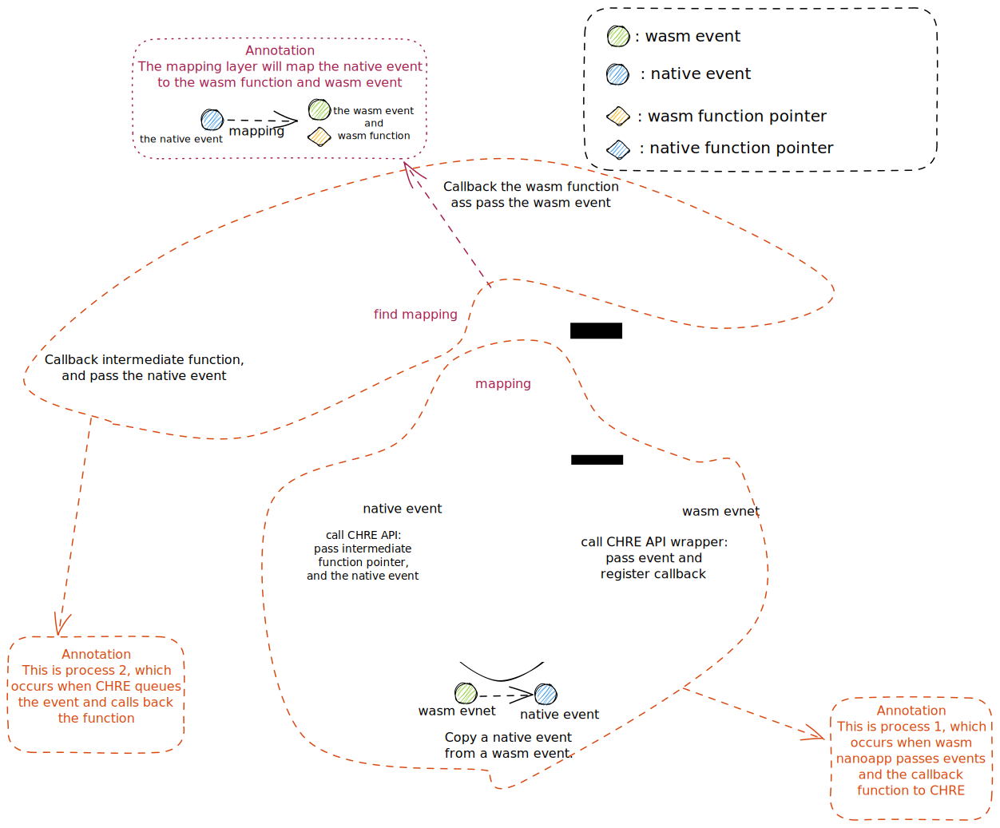

This blog will introduce our practice in integrating WASM with CHRE(Context Hub Runtime Environment), which solves some challenges that may also be encountered in other projects.

These challenges mainly focus on data sharing and callback functions.

We will introduce the architecture used in this projects and solutions to specific challenges.

### 1. The overview of CHRE-WASM

`CHRE` is the software environment where small native applications, called `nanoapp`, execute on a low-power processor and interact with the underlying system through the common `CHRE API`.
And CHRE is a event-driven model system, maintaining an event queue and distribute events to nanoapps.
We compile nanoapps into WASM and embed WAMR into CHRE to enable CHRE to run these new WASM nanoapps. 

The CHRE framework interacts with a given nanoapp through one of the three nanoapp entry points (`nanoappStart()`, `nanoappHandleEvent()`, and `nanoappEnd()`) or through a callback provided in a prior CHRE API call, and nanoapps interact with the CHRE framework and the underlying system through the CHRE API. 

```cpp
/**
 * Nanoapp APIs
 */

/**
 * Method invoked by the CHRE when loading the nanoapp.
 *
 * Every CHRE method is legal to call from this method.
 */
bool nanoappStart(void);

/**
 * Method invoked by the CHRE when there is an event for this nanoapp.
 *
 * Every CHRE method is legal to call from this method.
 *
 * @param eventData  The associated data, if any, for this specific type of
 *     event.  From the nanoapp's perspective, this eventData's lifetime ends
 *     when this method returns, and thus any data the nanoapp wishes to
 *     retain must be copied.  Note that interpretation of event data is
 *     given by the event type.
 */
void nanoappHandleEvent(uint32_t senderInstanceId, uint16_t eventType,
                        const void *eventData);

/**
 * Method invoked by the CHRE when unloading the nanoapp.
 */
void nanoappEnd(void);
```



When calling the CHRE API on Nanoapp, `wasm call native` will occur.
When CHRE calls APIs of wasm nanoapp, `native call wasm` will occur.
In these two processes, it involves both data transfer and sharing, as well as callback functions. We mainly conduct requirement analysis around these two processes.

We need to insert some intermediate layers, the wasm wrapper layer and native wrappe layer, between CHRE and wasm nanoapp to assist in data sharing and the use of callback functions.



### 2. Challenges and solutions
In this section, we will talk about the challenges we have encountered and the solutions we have used.


#### 2.1 Delivering and receving event to/from wasm nanoapp

##### 2.1.1 Delivering event 
When CHRE calls nanoapp's API `nanoappHandleEvent`, event data will be passed to the nanoapp. As the wasm nanoapp cannot directly access data outside of linear memory, and the nanoapp is allowed to directly access the field of the event structure, and we are unable to change the design of the original API, we have to copy the event data to the linear memory, and pass it to the wasm nanoapp.

If the original design of CHRE was that fields of the event structure must be accessed through APIs, then we could easily pass a `handle` representing event structure to wasm nanoapp, which will call native API to obtain fields of event structure.

##### 2.1.2 Receving event
CHRE will run multiple nanoapps, and may send the same event data to multiple nanoapps. Nanoapps can also send events to other nanoapps.

The events sent by wasm nanoapp are stored in its linear memory, but one wasm nanoapp cannot directly read the linear memory of other wasm nanoapps. Therefore, we copy the event to the linear memory of wasm nanoapp as event receiver.

Considering that CHRE may run both native and wasm nanoapps, we first copy the sent event data into `the native layer`, and it will be pushed into the event queue.

When an event is queued, if it is passed to the native nanoapp, the native nanoapp can directly access the event data; If it is passed to wasm nanoapp, it needs to be copied to its linear memory.



#### 2.2 Returned data used in wasm nanoapp is stored in native world
The event data received by wasm nanoapp or the return value obtained from the CHRE API contains data stored in the CHRE (host), such as a name (`const char *`). At this time, wasm nanoapp cannot directly access this part of the data.

Our approach to this is to create a mapping layer.

Here is an example, we can see that there is member `const char *name` in structure. We firstly copy this C-style string `name` from native to
wasm, then we map the origin string to the new string, and pass the new string to wasm nanoapp.

In similar situations, we will first check whether the string has been mapped.

It should be noted that the `const char *name` in the CHRE host will not be freed, so the copied new string does not need to be freed either.
Otherwise, this will be a relatively troublesome matter: we need to consider how to free the copied string.

```cpp
/**
 * This structure will be passed to wasm nanoapp
 */

struct chreAudioSource {
  /**
   * Example: "Camcorder Microphone"
   */
  const char *name;

  // ignore more fields
  // ...
};
```



Here is the code for this example. We define some functions for mapping, which operate on a globally unique mapping structure.

```cpp
// functions for mapping

/**
 * Get the offset mapping to nativeData in WASM Module instance
 * @param WASMModuleInst the WASM module instance to find a offset
 * @param nativeData the native data to be mapped to the offset
*/
uint32_t getOffset(wasm_module_inst_t WASMModuleInst, const void *nativeData);

/**
 * map the native data to the offset belonging to the WASM Module instance
 * @param WASMModuleInst the WASM module instance to find a offset
 * @param nativeData the native data to be mapped to the offset
 * @param dataOffset the wasm offset of the copied data
*/
bool setNativeData(wasm_module_inst_t WASMModuleInst, const void *nativeData, uint32_t dataOffset);

// the original CHRE API
bool chreAudioGetSource(uint32_t handle, 
                                struct chreAudioSource *audioSource);

// the CHRE API wrapper, wasm app will call this api
bool chreAudioGetSourceWrapper(wasm_exec_env_t exec_env, uint32_t handle, 
                               struct chreAudioSource *audioSource) {
    uint32_t nameOffset = 0;
    char *name = NULL;
    uint32_t nameLength = 0;
    wasm_module_inst_t WasmModuleInst = NULL;
    // Call the CHRE Api
    bool success = (WasmModuleInst = wasm_runtime_get_module_inst(exec_env))
                    && chreAudioGetSource(handle, audioSource);
    if (success) {
        // try to find a existed mapping name
        if(0 != (nameOffset = getOffset(WasmModuleInst, audioSource->name))) {
            audioSource->name = reinterpret_cast<const char*>(nameOffset);
        } else {
            nameLength = strlen(audioSource->name) + 1;
            nameOffset = wasm_runtime_module_malloc(WasmModuleInst, nameLength + 1, \
                                                    reinterpret_cast<void**>(&name));
            success = static_cast<bool>(nameOffset);
            if (success) {
                memcpy(name, audioSource->name, nameLength);
                audioSource->name = reinterpret_cast<const char*>(nameOffset);
                // map this native data to the WASM offset
                setNativeData(WasmModuleInst, audioSource, nameOffset);
            }
        }
    }
    return success;
}
```

#### 2.3 Host Unkonwn structure

When nanoapps send events to other nanoapps, `user-defined` event structures can be used. Only two nanoapps need to know these structure definitions, without letting CHRE know these.

However, when CHRE copies event structures from the linear memory of wasm nanoapp, it is necessary to know their structure definition, which needs to be done during the compilationof CHRE. 

Due to the fact that nanoapps can be dynamically loaded and use variable structures, it is impossible to know all event types at compile time.
So we provide another communication method for user-defined structures of nanoapp: serialization.

We defined a structure for passing serialized messages. When passing events, we serialize the event data and place it in the structure, and pass it out. There are no restrictions on the specific serialization methods used. As long as the serialization/deserialization methods used in both nanoapps are consistent.

```cpp
//structure for serialization
struct serialization_event {
    // Message length
    int length;
    // Serialization type
    int type;
    // Serialized messages have been stored in here
    const char *message;
    // Ignore some fields
    // ...
};
```

#### 2.4 callback function
When nanoapp sends events or messages, it also pass a callback function pointer to CHRE.
This callback function pointer is a wasm function pointer, which is a function table index in native world but needs to be called in native.
We cannot directly pass the wasm function pointer to CHRE, and we cannot change the original design of CHRE.

Therefore, we must use an intermediate function pointer instead of this wasm function pointer and pass it to CHRE.
When CHRE calls back this intermediate function, the intermediate function then calls the wasm function that actually needs to be called.

In the image below, we see step 8 from step 1.
Steps 1 to 5 describe the process of sending events through wasm nanoapp.
Steps 6 to 9 describe the process of CHRE calling the callback function.

After the wasm nanoapp sends an event and a callback function to the CHRE API wrapper, the CHRE API will copy a new native event, map this native event to wasm callback function and other related data, and then pass this native event and the intermediate function to the real CHRE API.

At an appropriate time, CHRE will call this intermediate function and pass the native event to it. At this point, the intermediate function will find the wasm function that should be called and call this wasm function.



Here is a code example that is related to the image above.

```cpp
/**
 * Callback which frees data associated with an event.
 * When this callback is invoked, 'eventData' is no longer needed
 * and can be released.
 *
 * @param eventType  The 'eventType' argument from chreSendEvent().
 * @param eventData  The 'eventData' argument from chreSendEvent().
 *
 * @see chreSendEvent
 */
typedef void (chreEventCompleteFunction)(uint16_t eventType, void *eventData);

/**
 * Enqueue an event to be sent to another nanoapp.
 * @param eventData  A pointer value that will be understood by the receiving
 *     app. Note that the caller no longer owns this memory after the call.
 * @param freeCallback  A pointer to a callback function.  After the lifetime
 *     of 'eventData' is over (either through successful delivery or the event
 *     being dropped), this callback will be invoked.  This argument is allowed
 *     to be NULL, in which case no callback will be invoked.
 *
 * @see chreEventDataFreeFunction
 */
bool chreSendEvent(uint16_t eventType, void *eventData,
                   chreEventCompleteFunction *freeCallback,
                   uint32_t targetInstanceId);

/**
 * Fucntions for converting a native event to a wasm event, converting a wasm
 * event to a native event, freeing a wasm event and freeing a native event.
*/
typedef struct convertFunctions {
    uint32_t eventType;
    uint32_t (*native2Wasm)(wasm_module_inst_t ,  const void *);
    void* (*wasm2Native)(wasm_module_inst_t , uint32_t);
    void (*wasmRelease)(wasm_module_inst_t, uint32_t);
    void (*nativeRelease)(void *);
}convertFunctions;

typedef struct mapInternalEventData{
    wasm_exec_env_t execEnv;
    const convertFunctions *functions;
    uint32_t originFuncOffset;
    uint32_t originDataOffset;
} mapInternalEventData;

/**
 * mapping void* (native event) to mapInternalEventData
 */
static std::map<void*, mapInternalEventData> eventDataMap;


/**
 * The intermediate function for registering callback function in ChreSendEvent
 * @see chreSendEvent
 */
void freeFunc(uint16_t eventType, void *eventData) {
    // Try to find the original wasm function, the wasm module execution environment,
    // and the wasm event data.

    wasm_module_inst_t WasmModuleInst = NULL;
    uint32_t argv[2];

    // We try to find a existing wasm function
    auto item = eventDataMap.find(eventData);

    if (item == eventDataMap.end()) {
        return;
    }
    
    // set the event type and the wasm event as parameters
    argv[0] = eventType;
    argv[1] = item->second.originDataOffset;
    WasmModuleInst = wasm_runtime_get_module_inst(item->second.execEnv);

    // call the original wasm function, pass the event type and the wasm event
    if(item->second.originFuncOffset)
        wasm_runtime_call_indirect(item->second.execEnv,  item->second.originFuncOffset, 2, argv);

    // free the copied native event
    item->second.functions->nativeRelease(eventData);
    
    // erase the mapping we used
    eventDataMap.erase(item);
}

/**
 * The wasm nanoapp will call this function when calling chreSendEvent
 */
bool chreSendEventWrapper(wasm_exec_env_t exec_env, uint16_t eventType,
                          uint32_t eventDataForWASM,
                          uint32_t funcOffset,
                          uint32_t targetInstanceId) {
    void *eventData = nullptr;
    wasm_module_inst_t WasmModuleInst = NULL;

    if(!(WasmModuleInst = wasm_runtime_get_module_inst(exec_env))) {
        return false;
    }

    //get function pointers for converting event between native and wasm
    const convertFunctions *funcs = getConvertFunctions(eventType);

    //get a new copied native event ,and all of the wasm event is copied here
    if (eventDataForWASM && !(eventData = funcs->wasm2Native(WasmModuleInst, eventDataForWASM))) {
        return false;
    }

    // mapping "the copied native event" to {execution environment, converting functions,
    // the original wasm function, the original wasm event}
    eventDataMap[eventData] = {
        exec_env,
        funcs,
        funcOffset,
        eventDataForWASM
    };

    // call the real CHRE API, but use the intermediate function "freeFunc" for callback
    return chreSendEvent(eventType, eventData, freeFunc, targetInstanceId);
}
```
