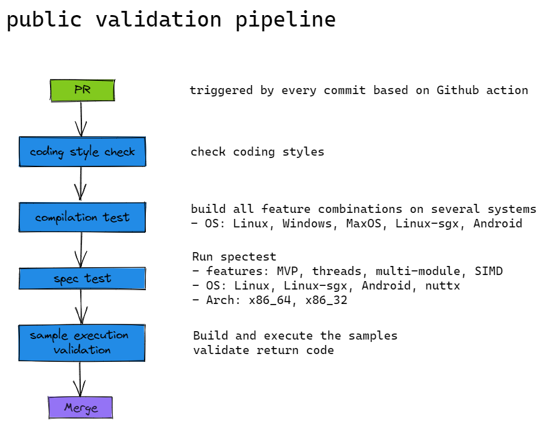
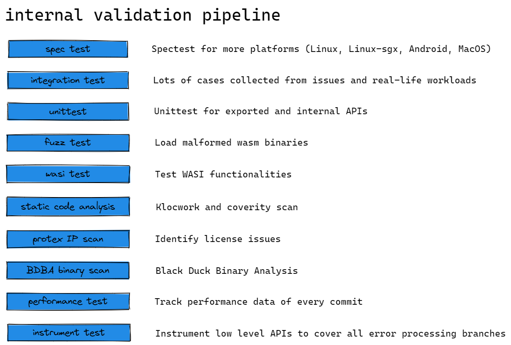

WAMR has a long pipeline of quality validation, they are basically separated to two parts.
- Public validation pipeline
	- Quick validation for most commonly used features
	- Ensure every PR will not break the basic functionality
- Internal validation pipeline
	- 7 * 24 hour available servers for full feature validation
	- Some special designed methods to cover corner cases

## Public validation pipeline

- Public tests requires:
	- fast and efficient
	- license friendly
	- cover most important features

## Internal validation pipeline

- These tests are maintained internally because they are:
	- time consuming, or never end
	- using incompatible licenses
	- compiled binaries which may not be suitable to commit to repo
	- requiring complex environment setup
	- using commercial software which require paid licenses

