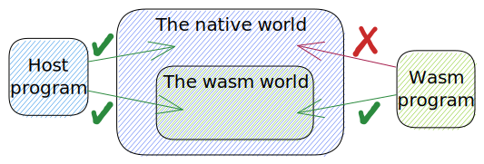
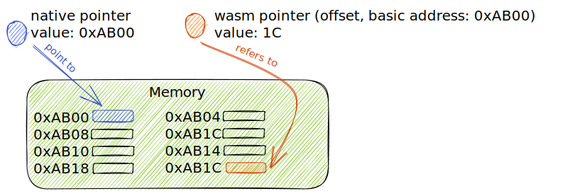
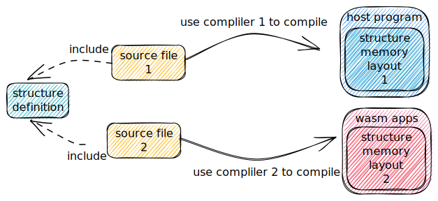

### Overview

##### 1. Two worlds

The data transferring occur between two worlds: `the native world` and `the wasm world`.
The native world refers to the memory space that the host program can legally access, and the wasm world refers to the memory space that the wasm program can legally access.

The native world contians the wasm world, so the host program can access both two worlds, but the wasm program can access the wasm world only.



##### 2. Two transferring path and regular solutions

In general, there are two data transferring paths:from host to wasm, and from wasm to host.

When transferring data between two worlds, we actually transfer "values" including integer, float, pointer, etc.

When an integer or float are transfered, they can be directly used, no matter which transferring path they are on.

But when a pointer is transfered, it may not be able to be used direclty.
If we transfer a pointer from wasm to host, this wasm pointer is actually a offset, and needs to be added with a basic address before being used.
If we transfer a pointer from host to wasm, the memory this native pointer point to can't be directly accessed by wasm apps due to sandboxed environment.


##### 3. The data buffer shared between two worlds
Usually, we will meet the requirement to share data buffer between two worlds.
The data stored in this data buffer can be structured or unstructured.
When storing structured data in this data buffer, we need to find a way to interpret this data buffer between two worlds.

Here are two ways to interpret this data buffer stored structured data:
(1) use serialization, such as json, attribute container by wamr, cbor, etc.
(2) share C structure definition betwee two world and make the memory layout of the structure be consistent, so that we can directly access members of the structure in both two worlds.

### Share C structure definition between two worlds

##### 1. Purpose
The purpose of sharing C structure definition between two worlds is to allow two worlds to directly access the members of the structure.

Source files will be complied to two worlds, and consequently the memory layout of the structure may differ between two worlds.


When source files are compiled into two worlds, there may be some potential problems due to using diffrent compilers or using diffrent compilation rules.

##### 2. Potential problems

(1) Using two compilers to compile host program and wasm apps may result in inconsistent memory layout of structures in two worlds.
* 32 bits alignment and 64 bits alignment can result in different memory layouts for structures

(2) The size and meaning of pointer may be different, which result in in consistent memory layout.
* The wasm pointer is 32 bits now (wasm32), but the native pointer may be 64 bits.
* The wasm pointer actually is a offset, not a complete memory address.

##### 3. Common methods
To solve these potential problems, here are some common methods:

(1) the inconsistence of the memory layout

To ensure the consistence of the memory layout of stuctures, we can use `static_assert` provided by most compilers.
When compiling sources files, no matter compiling host program or wasm apps, compiler will check these assertion.

```cpp
struct Node {
    int data;
    int number;
};
static_assert(
    sizeof(struct Node) == 8
    && offsetof(struct Node, data) == 0
    && offsetof(struct Node, number) == 4
);
```

(2) problems about pointers limitation 

- (2.1) wasm pointer actually is offset in the native world

    Before using the wasm pointer in host program, we need to add the basic address to this offset.

- (2.2) the size of pointer is diffrent bwtween two worlds
    
    We can use structure wrapper to solve this problem. The structure wrapper is defined and used by the host program, of which the memory layout is consistent with that of the structure defined and used by wasm apps.
 

```cpp
// used by the 64 bits host
struct Node {
    int data; //4B
    // padding 4B
    struct Node *next; // 8B
};

struct NodeWrapper {
    int data; //4B
    uint32_t next; //4B, is an offset
}

/****************************/

// used by 32 bits wasm apps
struct Node {
    int data; //4B
    struct Node *next; // 4B, wasm pointer actually is a offset
};
```