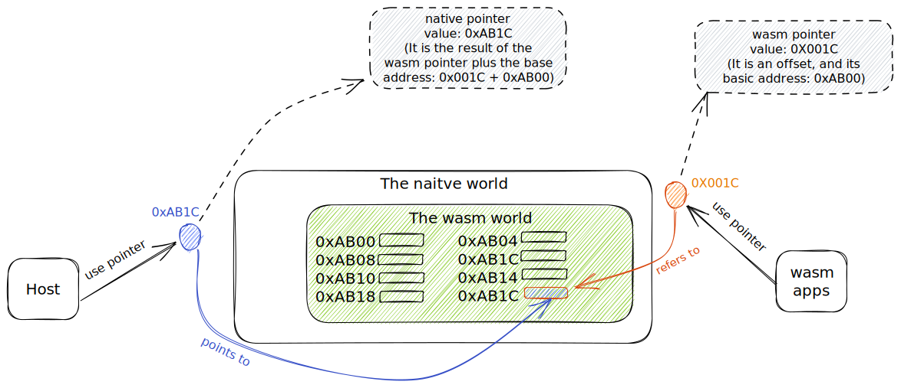

### Overview

##### 1. Two worlds

The data transferring occur between two worlds: `the native world` and `the Wasm world`.
The native world refers to the memory space that the host program can legally access, and the Wasm world refers to the memory space that the Wasm program can legally access.

The native world contains the Wasm world, so the host program can access both two worlds, but the Wasm program can access the Wasm world only.

In general, there are two data transferring paths:from host to Wasm, and from Wasm to host.


##### 2. Sharing data between two worlds over the stacks

The fundamental method of transferring data between two worlds is the **stack**.  When Wasm calls into an imported native function, all the function parameters are pushed into the Wasm stack, then the Wasm runtime will copy them into the native stack and continue the native function execution. In the reversed direction, the Wasm runtime copies from native stack to Wasm stack for native calling the Wasm function. Here we actually transfer the Wasm basic value type over the stack, including both 32 and 64 versions of integer and float.

##### 3. Sharing a buffer between two worlds
What if a pointer is transfered as a parameter during calling function into another world?  
If we transfer a pointer from Wasm to host, this Wasm pointer is actually a offset, and needs to be added with a basic address before being used.  

If we transfer a pointer from host to Wasm, the memory this native pointer point to can't be directly accessed by Wasm apps due to sandboxed environment.


##### 4. Interpreter the buffer content between two worlds
We often need to share data buffer between two worlds, and the data has to be structured rather than a simple byte array. Then we need some methods for both worlds interpreting the data structure.

Here are two common approaches to organize the shared data:  
(1) using serialization, such as json, cbor, and the attribute container by wamr etc. One side does serialization of structured data into the shared buffer, and the other side de-serializes the buffer to its internal data structure. It is a safe way, but with less execution efficiency.  

(2) sharing C structure definition between two world ands use the same memory layout, so that we can directly access members of the structure in both two worlds. It provides high efficiency, but it is not always guaranteed safe since there are a few risks. We are going to introduce a a few methods to ensure safe use of shared C structure defintion.

### Share C structure definition between two worlds

##### 1. The working flow
The purpose of sharing C structure definition between two worlds is to allow two worlds to directly access the members of the structure.

Source files will be complied to two worlds, and consequently the memory layout of the structure may differ between two worlds.


##### 2. Potential problems
When source files are compiled into two worlds, there may be some potential problems due to using different compilers or using different compilation rules.

(1) Using two compilers to compile host program and Wasm apps may result in inconsistent memory layout of structures in two worlds.
* 32 bits alignment and 64 bits alignment can result in different memory layouts for structures

(2) The size and meaning of pointer may be different, which result in in consistent memory layout.
* The Wasm pointer is 32 bits now (wasm32), but the native pointer may be 64 bits.
* The Wasm pointer actually is a offset, not a complete memory address.

##### 3. Common methods
To solve these potential problems, here are some common methods:

(1) Ensure consistence of the memory layout

To ensure the consistence of the memory layout of stuctures, we can use `static_assert` provided by most compilers.
When compiling sources files, no matter compiling host program or Wasm apps, compiler will check these assertion.

```cpp
struct Node {
    int data;
    int number;
};
static_assert(
    sizeof(struct Node) == 8
    && offsetof(struct Node, data) == 0
    && offsetof(struct Node, number) == 4
);
```

(2) problems about pointers limitation 

- (2.1) Wasm pointer actually is offset in the native world

    Before using the Wasm pointer in host program, we need to add the basic address to this offset. Refer to wamr runtime API `wasm_runtime_addr_app_to_native` for the details.


- (2.2) the size of pointer is different between two worlds
    
    When we transfer structural data from wasm to host, because the size of pointer is diffrent between two worlds, host program accessing members of the structure from linear memory may fail.
    
    We need to make the members of the structure accessible in both worlds.
    
    The structure shown below use `union` to solve this probelm.
    
    For the structure from the wasm linear memory: 
    * use `uint32_t next_offset` as `struct Node *next` in host program
    * use `struct Node *next` in wasm apps


```cpp
// The structure memory layout used by the 64 bits host
struct Node {
    int data; //4B
    // padding 4B
    union {
        struct Node *next; // 8B
        uint32_t next_offset; // 4B
        uint64_t _padding_64_bits; // 8B
    }
};

/****************************/

// The structure memory layout used by 32 bits Wasm apps
struct Node {
    int data; //4B
    // padding 4B
    union {
        struct Node *next; // 4B
        uint32_t next_offset; // 4B
        uint64_t _padding_64_bits; // 8B
    }
};
```