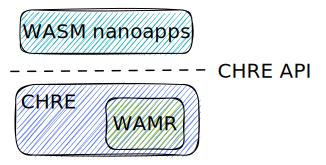
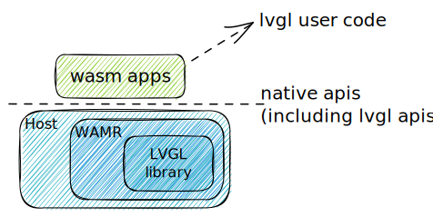
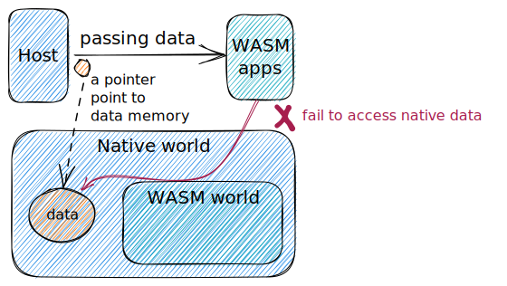
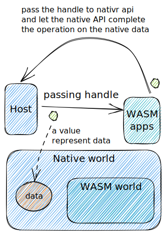
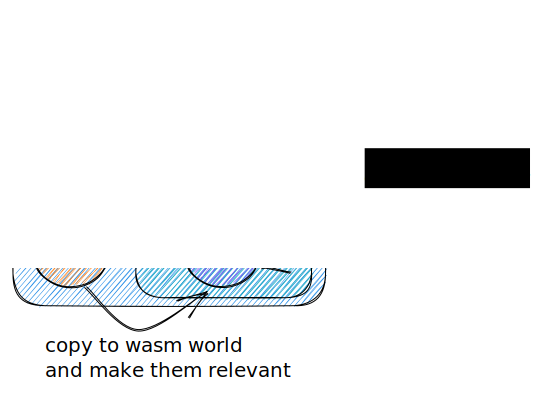
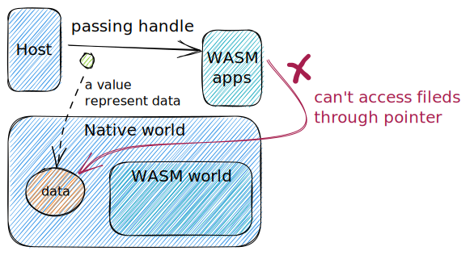
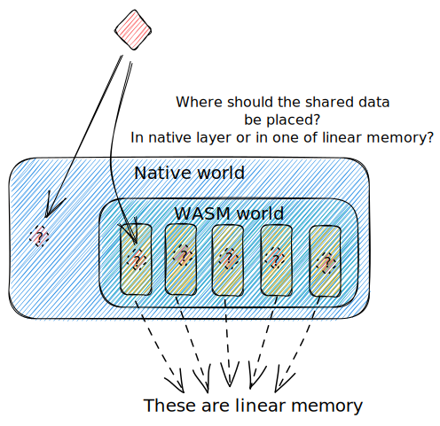

### Background

I have tried to integrate WASM with CHRE (Context Hub Runtime Environment) at my GitHub repo [(cher-wasm)](https://github.com/FromLiQg/chre-wasm/tree/wasm), and before that I learned the LVGL (Light and Versatile Graphics Library) samples provided by WAMR. 

CHRE is the Android sensor hub framework where small native applications, called nanoapps, which are executed on a low-power processor and interact with the underlying system through the common CHRE API. My goal was compiling the nanoapps source code into WASM and run them on the WAMR embedded into CHRE.  

LVGL is a graphics library to create beautiful UIs for any MCU, MPU and display type. The LVGL samples in WAMR demonstrate LVGL user code being compiled to WASM and performs identifical function across different platforms, while the lvgl library can be built into either Wasm as part of apps or native as part of the host. 

In the development, a common requirement is we should not change the original library design and original APIs.  

In this document, I will share the challenges that I observed in the practices. The possible solutions will be provided in another blog.

### Challenges
Here are some classic challenges we face.

We will provide some general solutions for some of them.

#### 1. The data structure is located in the native layer, but need to be used in wasm apps.

Because the wasm app in running in a sandboxed environment, the data located in the native layer can't be directly accessed by wasm apps. But here are two solutions.

solutions:

##### 1.1 handle
We can transfer a opaque handle representing a native structure pointer to wasm app, and wasm app will access all fields of the structure through calling native api, and pass this handle as the native pointer to corresponding native api.

##### 1.2 memory mapping layer

We can map the memory existing in the naitve layer to the memory existing in the wasm world, and copy this native memory to this wasm memory.

#### 2. Problems and risks when using handle as native structure pointer

##### 2.1 Wasm apps can't use it as pointer to access fields

If we use handle as native structure pointer in wasm apps, then we have a problem in getting fields of the structure: we have to call native api to get these fields.

##### 2.2 security concern

When we use handle, We have transferred the risk of manipulating data and executing code to the host program, because native code is not executed as WASM in runtime. If an error occurs while processing the handle, the program may crash.

Here are some examples of possible errors.

* Wasm apps may pass a wrong handle value which can cause safety risks
* Common memory issues, such as segment fault

#### 3. function callback

##### 3.1 call a wasm callback function in native layer

WASM function pointer is actually a table index for host program, and needs to pass runtime to be called back.
But limited by the inability to change the original library and API, we can't add the glue code helping to callback the wasm function to the original library.
In other words, we need to pass a function pointer that can be directly used by the native API.

##### 3.2 call a native callback function in wasm layer

It is similar to the previous situation. But if you can change you code compiled into WASM, using handle as native function pointer may be a good choice.

#### 4. Sharing data between multiple wasm apps

Wasm app is unable to access linear memory of other wasm apps. So we can't directly have different wasm apps read and write the shared memory.

We may use `handle` to represent the shared memory to solve this program. But this can lead to performance issues.

This issue is still difficult to solve: performance and security cannot be balanced at the same time.

