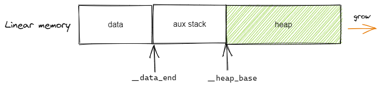
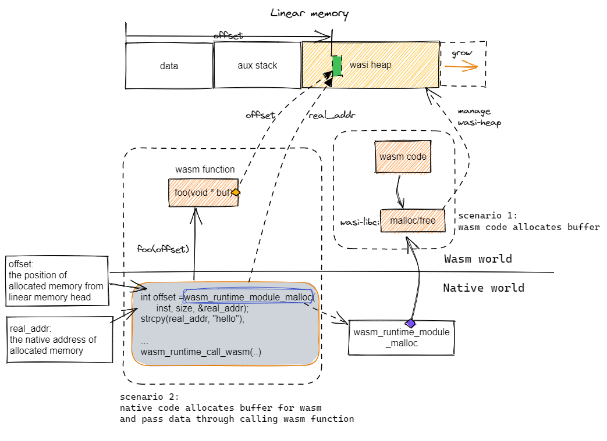
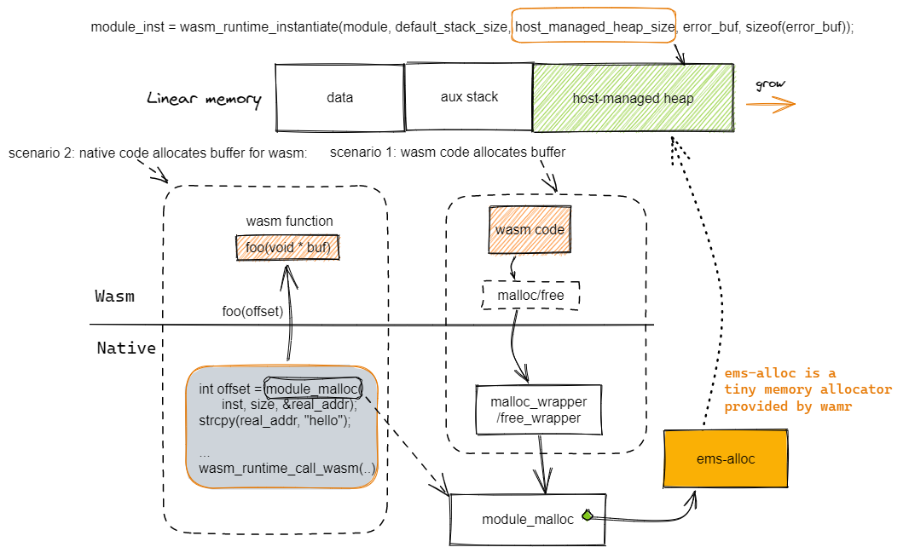

## Linear memory
The linear memory is a contiguous, mutable array of raw bytes. For most compilers, e.g. wasi-sdk, emsdk, rustc or asc, normally it includes three parts, data area, auxiliary stack area and heap area. The initial and maximum sizes of linear memory can be configured through the compilation parameters:
- For wasi-sdk, the initial/max size can be specified with -Wl,--initial-memory=n1,--max-memory=n2
- For emsdk, the initial/max size can be specified with -s INITIAL_MEMORY=n1 -s MAXIMUM_MEMORY=n2 -s ALLOW_MEMORY_GROWTH=1 or -s TOTAL_MEMORY=n
- For asc, they can be specified with --initialMemory and --maximumMemory flags  


**Data area**: The size is determined by the compiler like wasi-sdk and the its value is provided in the Wasm GLOBAL `__data_end`.  

**Aux stack**: For wasi-sdk, the size can be specified with -z stack-size=n, for emsdk, the size can be specified with -s TOTAL_STACK=n  

**Heap area**: The value of heap base address is provided in the Wasm GLOBAL `__heap_base` by compilers such as emsdk and wasi-sdk.    


Note: For embedded environment where we want the linear space can be smaller than 64K, it is recommended to export `__heap_base` and  `__data_end`. When there are no memory grow opcode in the Wasm module, WAMR will truncate the linear memory into the size indicated by `__heap_base`, so that the linear memory can be less than 64K.


## The Wasm heap and its typical usages

In the most situations, a Wasm instance needs a heap for dynamic memory management. The Wasm heap is located in its own linear memory space.  

There are two typical usages of heap:
1. Wasm code calls malloc/free on its own heap
2. The native code of the host calls `wasm_runtime_module_malloc` to allocate buffer from the Wasm app's heap, and then use it for sharing data between host and Wasm.  

WAMR supports two heap types: **wasi-heap** and **host-managed-heap**.

## WASI-libc heap
**Create wasi-heap**  
If a Wasm module is built with WASI-LIBC, the `wasi-heap` will be created and managed by the memory allocator provided by the wasi-libc.   

**Scenario 1**: When the Wasm code calls malloc/free, wasi-libc memory allocator will operate on the `wasi-heap`.  

**Scenario 2**: If the native calls `wasm_runtime_module_malloc`, it will call the wasi-libc functions `malloc/free`. Note: this is only supported when the Wasm module exports functions `malloc/free`.  



## Host managed heap
**When is it needed?**  
The host-managed-heap (formerly called app-heap) is usually required for either situation below:
1. Wasm module requires import of malloc/free (usually caused by app build without WASI, like for embedded)
2. Native and Wasm need to share data through buffer but the Wasm module has no `export` of malloc/free for any reason  

**Create host-managed-heap**  
The creation of host-managed-heap is done through passing non-zero value to the parameter `host_managed_heap_size` in the function call of module instantiation as below.
```
module_inst = wasm_runtime_instantiate(module, default_stack_size, 
                                       host_managed_heap_size, 
                                       error_buf, sizeof(error_buf));
```

**Working flow**  
  

Once the `host-managed-heap` is created, it will be managed by the `ems` that is a tiny memory allocator provided by WAMR.  

**Scenario 1**: When the Wasm code call malloc/free, it will go to the imported native functions `malloc_wrapper/free_wrapper`.  These two wrapper functions then calls the malloc/free of `ems`. 

**Scenario 2**: If the native calls `wasm_runtime_module_malloc`, it will also call the ems memory allocator to operate the host-managed-heap.   

## Q&A
- Can the wasi-heap and host-managed-heap co-exist?
    - yes. When the wasi-libc malloc/free are not exported by wasm module and the default_stack_size parameter is non-zero in calling wasm_runtime_instantiate(), two heaps will co-exist. Then the scenario #1 will go the wasi-heap and the scenario #2 will go the host-managed-heap.

