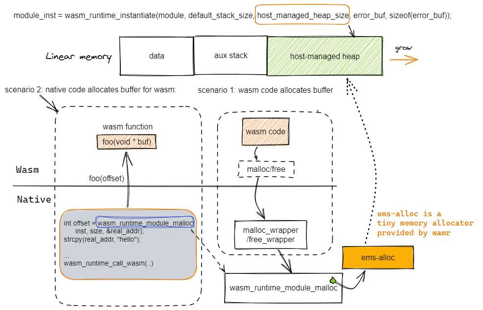

## Linear memory
The linear memory is a contiguous, mutable array of raw bytes. For most compilers, e.g. wasi-sdk, emsdk, rustc or asc, normally it includes three parts, data area, auxiliary stack area and heap area.
- For wasi-sdk, the initial/max size can be specified with -Wl,--initial-memory=n1,--max-memory=n2
- For emsdk, the initial/max size can be specified with -s INITIAL_MEMORY=n1 -s MAXIMUM_MEMORY=n2 -s ALLOW_MEMORY_GROWTH=1 or -s TOTAL_MEMORY=n
- For asc, they can be specified with --initialMemory and --maximumMemory flags  


**Data area**: the size is determined by the compiler like wasi-sdk and the its value is provided in the Wasm GLOBAL `__data_end`.  

**Aux stack**: For wasi-sdk, the size can be specified with -z stack-size=n, for emsdk, the size can be specified with -s TOTAL_STACK=n  

**Heap area**: The value of heap base address is provided in the Wasm GLOBAL `__heap_base` by compilers such as emcc and wasi-sdk.    


Note: For embedded environment where we want the linear space can be smaller than 64K, it is recommended to export `__heap_base` and  `__data_end`. When there are no memory grow opcode in the Wasm module, WAMR will truncate the linear memory into the size indicated by `__heap_base`, so that the linear memory can be less than 64K.


## The Wasm heap and its typical usages

In the most situations, a Wasm instance needs a heap for dynamic memory management. The Wasm heap is located in its own linear memory space.  

There are two typical usages of heap:
1. Wasm code call malloc/free on its own heap
2. The native code of the host calls `wasm_runtime_module_malloc` to allocate buffer from the Wasm app's heap, and then use it for sharing data between host and Wasm.  

WAMR supports two heap types: **wasi-heap** and **host-managed-heap**.

## WASI heap
If a Wasm module is built with WASI-LIBC, the `wasi-heap` will created and managed by the memory allocator provided by the wasi-libc.   

Scenario 1: When the Wasm code call malloc/free, wasi-libc memory allocator will operate on the `wasi-heap`.  

Scenario 2: If the native calls `wasm_runtime_module_malloc`, it will call the wasi-libc functions `malloc/free`. Note: this is only supported when the Wasm module exports functions `malloc/free`.  


## Host managed heap
The host-managed-heap is normally required for either situation below:
1. Wasm module imports malloc/free (usually caused by app build without WASI, like for embedded)
2. Native and Wasm need to share data through buffer but the Wasm module has no `export` of malloc/free for any reason  

The creation of host-managed-heap is done through pass non-zero value to the parameter `host_managed_heap_size` in the module instantiation call as below.
```
module_inst = wasm_runtime_instantiate(module, default_stack_size, 
                                       host_managed_heap_size, 
                                       error_buf, sizeof(error_buf));
```
Once the `host-managed-heap` is created, it will be managed by the `ems` that is a tiny memory allocator provided by WAMR.  

Scenario 1: When the Wasm code call malloc/free, it will go to the imported native functions `malloc_wrapper/free_wrapper`.  These two wrapper functions then call the malloc/free of `ems`. 

Scenario 2: If the native calls `wasm_runtime_module_malloc`, it will also call the ems memory allocator to operate the host-managed-heap.   



