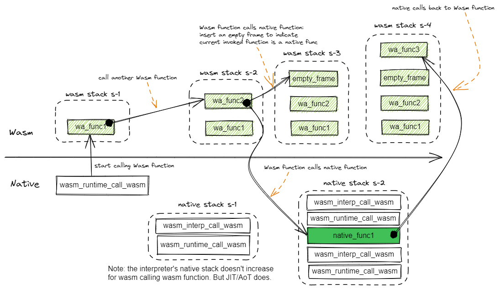
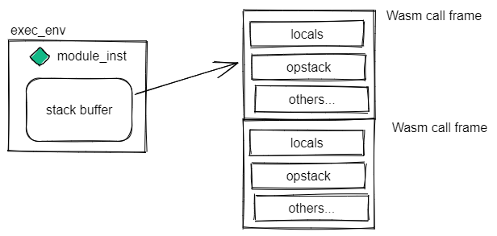

## The status of stacks

During the WAMR executes a Wasm function, there will be a Wasm stack created and used. For interpreter mode, as the Wasm functions intercall, the Wasm stack frames will grow, while the native stack keeps unchanged.

When the Wasm calls into a imported native function and the native function then call into some Wasm function, the native stack will add a frame, and an empty frame will be inserted into wasm stack to indicate the function is imported from native.



## Execution environment (exec_env)
Before native calling a Wasm function with `wasm_runtime_call_wasm`, a exec_env should be prepared by calling wasm_runtime_create_exec_env(). It will allocate a stack buffer with size given in the function call.

```
  /* lookup a WASM function by its name */
  func = wasm_runtime_lookup_function(module_inst, "fib", NULL);

  /* creat an execution environment to execute the WASM functions */
  exec_env = wasm_runtime_create_exec_env(module_inst, stack_size);

  /* arguments are always transferred in 32-bit element */
  uint32 argv[2];
  argv[0] = 8;

  /* call the WASM function */
wasm_runtime_call_wasm(exec_env, func, 1, argv) ;

```

During executing Wasm functions, the `exec_env` is mostly the first parameter in each frame of the native stack. The runtime requires the native APIs for Wasm to import must have the first parameter as `exec_env`. The detailed guidance and samples can be referred fom [Export native API to WASM application](https://github.com/bytecodealliance/wasm-micro-runtime/blob/main/doc/export_native_api.md).


In the interpreter mode, every function call will add a new call frame in the stack buffer. All the Wasm LOCALs and opocde stack of a function will be located inside the call frame.


In the AoT/JIT mode, the call frames of Wasm function are integrated with the runtime native stack frame. Being different with interpreter mode, each Wasm function call will introduce a new call frame in the runtime native stack.

Normally the stack buffer in the exec_env is no longer used for AoT/JIT. However it can be still used in a few situations:
- dump call stack，
- dump memory profiling,
- dump perf profiling

The dumping option can be enabled through adding compilation option `-DWAMR_BUILD_DUMP_CALL_STACK=1` for runtime, and `--enable-dump-call-stack` for the wamrc. When it is not enabled, the stack buffer can be zero length (?)

## The default wasm stack size

The WAMR provides some APIs like `wasm_application_execute_func` that further simplified the execution of Wasm functions. The exec_env allocation and releasing will be done automatically.

```
bool
wasm_application_execute_func(WASMModuleInstanceCommon *module_inst,
                              const char *name, int32 argc, char *argv[])
```


The host needs to provide the default size for runtime creating a stack for the above situation. This can be done through passing non-zero value to the parameter `default_stack_size` in the function call of module instantiation as below.
```
module_inst = wasm_runtime_instantiate(module, default_stack_size,
                                       host_managed_heap_size,
                                       error_buf, sizeof(error_buf));
```