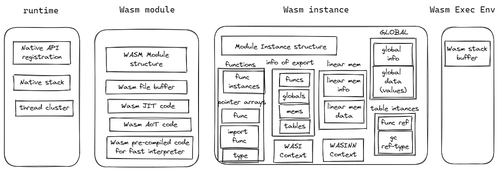
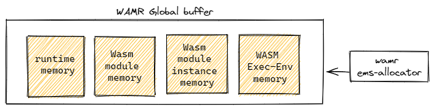

# The WAMR memory categories

According to the lifecycle and associated functionalities, we put the memory used in WAMR into four categories:
- **runtime memory**:  memory used by runtime globally
- **Wasm module memory**: memory used for a loaded Wasm module, freed when the module is unloaded
- **Wams module instance memory**: memory used for a Wasm module instance, freed when the instance is destroyed
- **Execution environment memory**: memory use for execution of Wasm function from a Wasm module instance. It is provided by the host caller, and no longer needed after the execution is finished.



# Memory allocators
WAMR supports a few modes for managing the memory:
- **Alloc_With_Pool**: The mode restricts all the memory used by wamr in a fixed memory region that was provided by the host during initiating the WAMR runtime. All the memory categories are allocated inside the memory region by using WAMR built-in memory allocator `ems`.    

      

    Runtime initializaion sample:  
    ```C
    /* all the runtime memory allocations are retricted in the global_heap_buf array */
    static char global_heap_buf[512 * 1024];
    RuntimeInitArgs init_args;
    memset(&init_args, 0, sizeof(RuntimeInitArgs));

    /* configure the memory allocator for the runtime */
    init_args.mem_alloc_type = Alloc_With_Pool;
    init_args.mem_alloc_option.pool.heap_buf = global_heap_buf;
    init_args.mem_alloc_option.pool.heap_size = sizeof(global_heap_buf);
    wasm_runtime_full_init(&init_args);
    ```
- **Alloc_With_System_Allocator**: Runtime will use the system default malloc/free for all the memory allocation.
- **Alloc_With_Allocator**: The host can set a specific malloc/free implementation to runtime during initialization. refer to stuct [`RuntimeInitArgs`](https://github.com/bytecodealliance/wasm-micro-runtime/blob/d75cb3224f7c8a6565937a6389936a1a2160fc59/core/iwasm/include/wasm_export.h#L143) and [`MemAllocOption`](https://github.com/bytecodealliance/wasm-micro-runtime/blob/d75cb3224f7c8a6565937a6389936a1a2160fc59/core/iwasm/include/wasm_export.h#L111)

# Runtime memory
The WAMR runtime  memory:
- **Native API registration**: runtime internal data maintained for the native API registration
- **Native stack**: The stack for runtime execution
- **thread cluster**: The memory used for library pthread and wasi-thread

# Wasm module memory
- **WASM Module structure**: WAMR maintains the module data using C struct [`WASMModule`](https://github.com/bytecodealliance/wasm-micro-runtime/blob/d75cb3224f7c8a6565937a6389936a1a2160fc59/core/iwasm/interpreter/wasm.h#LL407C8-L407C19). During initializing `WASMModule`, there are some sub data structures allocated for globals, memory, tables, imports, exports etc and referred by the fields of `WASMModule`. 
- **Wasm file buffer**: The host caller provides the buffer for holding the wasm file content. The runtime will hold this reference during the whole life of Wasm module. After the module is unloaded, it is no longer needed.
- **Wasm JIT code**: The buffer that runtime allocated for holding the generated machine code by the Just-in-Time compilation.
- **Wasm AoT code**: The memory pages that runtime map to the AoT file by using mmap().
- **Wasm pre-compiled bytecode**: the fast interpreter will pre-compile the Wasm bytecode to intenal bytecode format and save it in internally allocates buffer.

# Wasm instance
- **Module Instance structure**: WAMR maintains the module instance data using C struct [`WASMModuleInstance`](https://github.com/bytecodealliance/wasm-micro-runtime/blob/d75cb3224f7c8a6565937a6389936a1a2160fc59/core/iwasm/interpreter/wasm_runtime.h#L252). 
- **function data**: contain the function instances and a few pointer arrays that refer to the native function, function type and imported functions
- **linear memory**: the memory for the linear memory data space and associated information
- **global data**: the memory for the data of Wasm globals and associated information
- **exports**: 
- **tables**: 
- **WASI context**
- **WASI-NN context**

# Execution environment
- **stack buffer**: the buffer is used for the Wasm function calling stack. It can be provided by the host caller or let the runtime handle the memory allocation. refer to [Understand the WAMR stacks](../understand_wamr_stack/)
