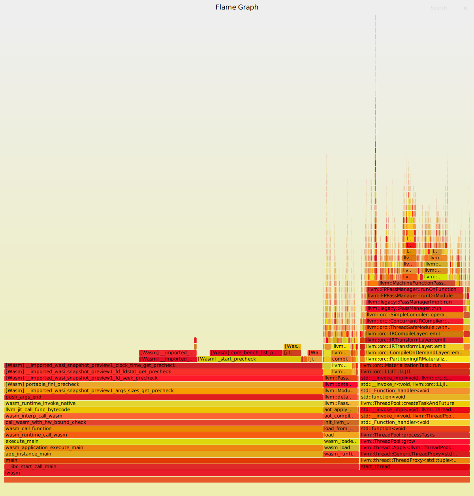

Profiling a Wasm application can provide valuable insights into its performance. In this blog post, we'll explore how to use [linux perf](https://perf.wiki.kernel.org/index.php/Main_Page) to analyze Wasm applications running on the WAMR with JIT compilation.

Linux perf is a versatile performance analysis tool that helps developers understand an optimize the behavior of their applications. It provides detailed information about various aspects of program execution, including CPU usage, memory access patterns, and function call traces.

## With perf report

Let's dive into profiling a Wasm application using WAMR(aot and jit) and linux perf.

1. Before profiling, recompile WAMR with the LLVM JIT and AOT compilation option:

```bash
$ cmake -S . -B bulid -DWAMR_BUILD_JIT=1 -DWAMR_BUILD_AOT=1
```

2. Use perf to profiling

```bash
# perf.data.raw is perf output. it records all call stacks for every sample event.
# but it can't translate jiited function address to jitted function name
$ perf record -k mono -g --output=perf.data.raw -- iwasm --perf-profile <.wasm or .aot>
```

2.1 merge jitted symbols information

*only if iwasm is running under jit mode. aot doesn't need this step*

``` bash
# read jit-xxx.dump file generated by wamr and get jitted symbols information
$ perf inject --jit --intput=perf.data.raw --output=perf.data
```

You can use `perf report` to review _perf.data_. It includes performance counter profile information recorded via `perf record`.

```
    76.07%     0.00%  iwasm    libc.so.6             [.] __libc_start_call_main
            |
            ---__libc_start_call_main
               main
               |
                --68.33%--app_instance_main
                          wasm_application_execute_main
                          execute_main
                          wasm_runtime_call_wasm
                          wasm_call_function
                          call_wasm_with_hw_bound_check
                          wasm_interp_call_wasm
                          llvm_jit_call_func_bytecode
                          wasm_runtime_invoke_native
                          push_args_end
                          aot_func#1
                          aot_func#32
                          |
                           --68.33%--aot_func#5
                                     |
                                      --68.32%--aot_func#4
                                                |
                                                 --68.19%--aot_func#2

    68.33%     0.00%  iwasm    iwasm                 [.] app_instance_main
            |
            ---app_instance_main
               wasm_application_execute_main
               execute_main
               wasm_runtime_call_wasm
               wasm_call_function
               call_wasm_with_hw_bound_check
               wasm_interp_call_wasm
               llvm_jit_call_func_bytecode
               wasm_runtime_invoke_native
               push_args_end
               aot_func#1
               aot_func#32
               |
                --68.33%--aot_func#5
                          |
                           --68.32%--aot_func#4
                                     |
                                      --68.19%--aot_func#2
```

## With Flamegraph

[Flamegraph](https://github.com/brendangregg/FlameGraph0) is a visualization technique that represents the call stack of a program. They provide a clean overview of where CPU time is spent during program execution.

All based on previous generated _perf.data_. And need to download [FlameGraphs](https://github.com/brendangregg/FlameGraph) firstly.

```bash
$ perf script -i perf.data > out.perf
#fold stacks
$ ./FlameGraph/stackcollapse-perf.pl out.perf > out.folded
#render a flamegraph
$ ./FlameGraph/flamegraph.pl out.folded.translated > perf.svg
```

Because jitted functions all have the same form names like _aot_func#NUMBER_, it's hard for developers to understand. There is a script to do translation.

```bash
# translate jitted function names into their original wasm function names
$ python trans_wasm_func_name.py --wabt_home <wabt installation> --folded out.folded <wasm>
#render a flamegraph
$ ./FlameGraph/flamegraph.pl out.folded.translated > perf.svg
```



**For more details, please refer to [doc](https://github.com/bytecodealliance/wasm-micro-runtime/blob/main/doc/perf_tune.md#7-use-linux-perf)**